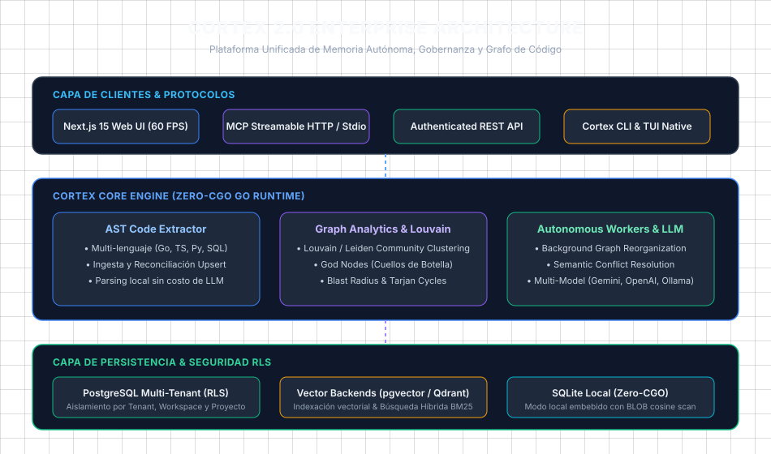
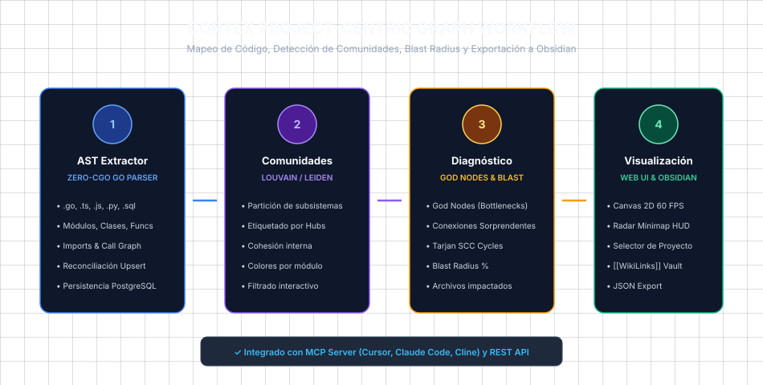
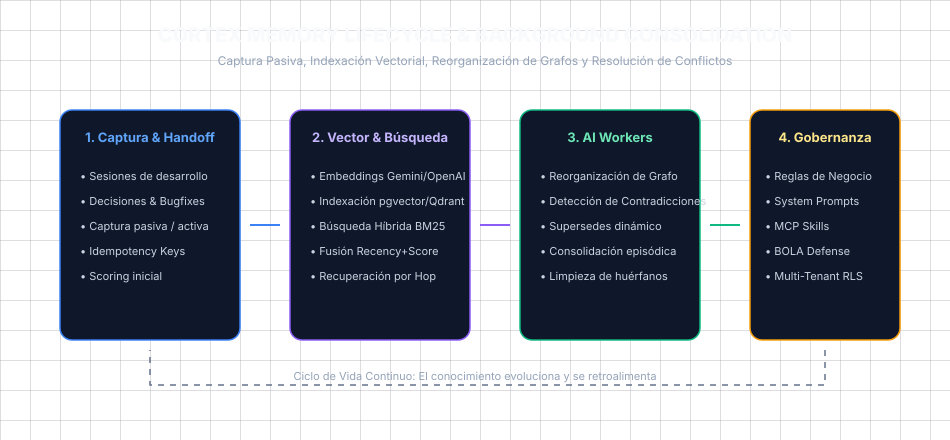

# 🧠 Cortex: Autonomous AI Memory & Project Knowledge Graph

<p align="center">
  
</p>

<p align="center">
  <a href="#features"></a>
  <a href="#features"></a>
  <a href="#features"></a>
  <a href="#features"></a>
  <a href="#features"></a>
</p>

**Cortex** es una plataforma enterprise de **memoria episódica autónoma, gobernanza de proyectos y grafo de conocimiento de código** diseñada para agentes de IA (Cursor, Claude Code, Cline, Windsurf) y equipos de desarrollo.

Combina extracción estática de código AST (Go, TS/JS, Python, SQL), clustering de comunidades (Louvain/Leiden), análisis de blast radius, gobernanza corporativa, búsqueda híbrida (BM25 + Vectores) y persistencia segura Multi-Tenant respaldada por PostgreSQL con Row-Level Security (RLS) y SQLite local.

---

## ⚡ Capacidades Principales

### 1. 🌐 Grafo de Código & Conocimiento por Proyecto (Estilo Graphify)
- **Extractor AST Nativo (Zero-CGO):** Analiza código en Go puro (`.go`, `.ts`, `.tsx`, `.js`, `.py`, `.sql`) sin enviar código a LLMs externos ni gastar tokens de API.
- **Clustering de Comunidades (Louvain/Hubs):** Agrupa automáticamente los subsistemas funcionales del proyecto y etiqueta los hubs arquitectónicos.
- **God Nodes & Detección de Ciclos:** Identifica cuellos de botella (`in_degree`/`out_degree`) y dependencias circulares (Tarjan SCC).
- **Cálculo de Blast Radius:** Mide el impacto porcentual y lista los archivos/funciones afectados al modificar cualquier componente.
- **Reconciliación Incremental en Refactorizaciones:** Si el archivo `A` antes dependía de `B` y ahora depende de `B` y `C`, Cortex actualiza y reconcilia las relaciones de forma instantánea.
- **Exportador a Obsidian Vault:** Descarga notas Markdown interconectadas con enlaces `[[WikiLinks]]`.

<p align="center">
  
</p>

### 2. 🧠 Memoria Episódica & Aprendizaje Continuo
- Registra decisiones de arquitectura, correcciones de bugs, patrones y descubrimientos técnicos.
- **Búsqueda Híbrida Inteligente:** Combina BM25 de texto completo con similitud vectorial (Gemini, OpenAI, Ollama, pgvector, Qdrant) y ponderación de frescura/importancia.
- **Workers Autónomos en Background:** Reorganización periódica de grafos, detección de contradicciones y resolución de conflictos (`supersedes`).

<p align="center">
  
</p>

### 3. 🛡️ Gobernanza Corporativa & Multi-Tenancy
- **PostgreSQL RLS (Row-Level Security):** Aislamiento estricto por Tenant, Workspace y Proyecto.
- **Reglas de Proyecto & Prompts del Sistema:** Inyección dinámica de reglas corporativas y skills en cada consulta de los agentes.

---

## 🚀 Inicio Rápido

### Modo Servidor con Docker (Recomendado)

```bash
# Iniciar PostgreSQL y Cortex Server
docker compose up --build -d
```

Inicia el servidor autenticado en el puerto `7438` con soporte MCP Streamable HTTP en `/mcp` y API REST en `/api/*`.

### Interfaz Web (Control Room Next.js 15)

```bash
cd web
npm install
npm run dev
```

Abre [http://localhost:3000](http://localhost:3000) e ingresa la URL del servidor y el Bearer Token.

---

## 🔌 Integración con Agentes MCP (Cursor, Claude Code, Cline)

Agrega Cortex como servidor MCP en tu editor o agente:

### Configuración MCP (Streamable HTTP):

```json
{
  "mcpServers": {
    "cortex": {
      "url": "https://tu-servidor-cortex.railway.app/mcp",
      "headers": {
        "Authorization": "Bearer TU_BEARER_TOKEN"
      }
    }
  }
}
```

### Herramientas MCP Disponibles:
- `cortex_ingest_code`: Escanea e ingesta repositorios o archivos modificados tras refactorizaciones.
- `cortex_get_blast_radius`: Calcula los archivos y funciones impactados por un cambio.
- `cortex_analyze_architecture`: Diagnostica comunidades funcionales, God nodes y anomalías.
- `cortex_detect_cycles`: Detecta dependencias e importaciones circulares.
- `cortex_save` / `cortex_handoff`: Guarda observaciones y handoffs con idempotencia.
- `cortex_search` / `cortex_relate`: Búsqueda híbrida y creación de aristas de grafo.
- `cortex_get_project_context`: Obtiene reglas corporativas y skills del proyecto.

---

## 📚 Documentación Técnica

- [Guía de Inteligencia de Grafos & AST](docs/GRAPH_INTELLIGENCE.md)
- [Catálogo de Herramientas MCP](docs/MCP.md)
- [Referencia de API HTTP REST](docs/HTTP-API.md)
- [Arquitectura del Sistema](docs/ARCHITECTURE.md)
- [Configuración Multi-Formato](docs/CONFIGURATION.md)
- [Exportación a Obsidian](docs/OBSIDIAN_EXPORT.md)
- [Despliegue en Producción (Server & Docker)](docs/SERVER.md)

---

## 🛠️ Comandos de Desarrollo

```bash
# Descargar dependencias y compilar binario
go mod download
make build

# Ejecutar suite de pruebas unitarias y de integración
go test -v -count=1 ./...

# Linter oficial
golangci-lint run ./...

# Compilar frontend Web
cd web && npm run build
```

---

<p align="center">
  <b>Cortex 2.0</b> • Diseñado para potenciar el desarrollo de software asistido por IA de forma duradera y confiable.
</p>
