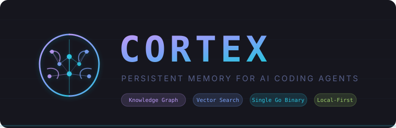

<p align="center">
  
</p>

<p align="center">
  <a href="https://github.com/lleontor705/cortex/actions/workflows/ci.yml"></a>
  <a href="https://github.com/lleontor705/cortex/releases/latest"></a>
  <a href="https://github.com/lleontor705/cortex/blob/master/LICENSE"></a>
  <a href="https://goreportcard.com/report/github.com/lleontor705/cortex"></a>
</p>

<p align="center">
  <a href="docs/INSTALLATION.md">Installation</a> &bull;
  <a href="docs/AGENT-SETUP.md">Agent Setup</a> &bull;
  <a href="docs/BENCHMARKS.md">Benchmarks</a> &bull;
  <a href="docs/ARCHITECTURE.md">Architecture</a> &bull;
  <a href="docs/RECOMMENDATIONS.md">Recommendations</a> &bull;
  <a href="CONTRIBUTING.md">Contributing</a>
</p>

---

> **cortex** `/ˈkɔːr.tɛks/` — the outer layer of the brain responsible for memory, attention, perception, and cognition.

Your AI coding agent forgets everything when the session ends. **Cortex gives it a brain** — with a knowledge graph, vector search, and temporal reasoning. One Go binary. Zero cloud dependencies.

```
Agent (Claude Code / Cursor / Gemini CLI / Codex / VS Code / OpenCode / ...)
    |  MCP stdio
Cortex (single Go binary)
    |
SQLite + FTS5 + Knowledge Graph + Vector Search + Importance Scoring
```

## Why Cortex?

| | Cortex | Mem0 | Zep/Graphiti | claude-mem |
|---|:---:|:---:|:---:|:---:|
| **Single binary** | Go | Python + Neo4j/Qdrant | Python + Neo4j | TS + Python + ChromaDB |
| **Knowledge graph** | SQLite-native | Neo4j (cloud) | Neo4j (cloud) | No |
| **Vector search** | Ollama (local) or OpenAI | Qdrant/Pinecone | Neo4j vectors | ChromaDB |
| **Temporal reasoning** | Built-in | No | Graphiti | No |
| **Privacy** | 100% local | Cloud option | Cloud option | Local |
| **Agent lock-in** | None (MCP) | LangChain-centric | Python SDKs | Claude only |
| **Setup** | `go install` | pip + docker | pip + docker | npm + bun + uv |

## Quick Start

```bash
# Install
brew install lleontor705/tap/cortex    # macOS / Linux
go install github.com/lleontor705/cortex/cmd/cortex@latest  # all platforms

# Setup your agent
cortex setup claude-code   # or: opencode, gemini-cli, codex
```

That's it. No Node.js, no Python, no Docker. **One binary, one SQLite file.**

<details>
<summary>Setup for VS Code, Cursor, Windsurf, and other MCP clients</summary>

| Agent | Setup |
|-------|-------|
| VS Code (Copilot) | `code --add-mcp '{"name":"cortex","command":"cortex","args":["mcp"]}'` |
| Cursor | Add to `.cursor/mcp.json` |
| Windsurf | Add to MCP config |

Full per-agent config, Memory Protocol, and compaction survival: [docs/AGENT-SETUP.md](docs/AGENT-SETUP.md)
</details>

<details>
<summary>Migrating from Engram?</summary>

```bash
cortex import --from-engram --path ~/.engram/engram.db
```

100% API-compatible. All 14 Engram MCP tools work identically. Cortex adds 8 more. Full migration script: [`scripts/migrate-from-engram.sh`](scripts/migrate-from-engram.sh)
</details>

## How It Works

```
1. Agent completes significant work (bugfix, architecture decision, etc.)
2. Agent calls mem_save -> title, type, What/Why/Where/Learned
3. Cortex persists to SQLite with FTS5 indexing + auto-embedding
4. Entities auto-extracted (files, URLs, packages, symbols)
5. Agent relates observations via knowledge graph (mem_relate)
6. Next session: agent searches memory -> FTS5 + vector + graph boost
```

## Features

### Memory Engine
- **Full-Text Search (FTS5)** with BM25 ranking and topic key lookup
- **Vector Search** via Ollama (local, free) or OpenAI — hybrid FTS5 + cosine similarity with RRF fusion
- **Knowledge Graph** with typed edges (`references`, `relates_to`, `follows`, `supersedes`, `contradicts`) and BFS traversal
- **Temporal Reasoning** — search as-of a specific date, edges with validity windows
- **Importance Scoring** — `base + typeBonus + accessBonus + recencyBonus + edgeBonus - agePenalty`, clamped [0.0, 5.0]

### Intelligence
- **Entity Linking** — auto-extract files, URLs, packages, symbols from observations
- **Memory Consolidation** — find and merge duplicate topic keys across sessions
- **Project DNA** — auto-generate structured project summaries (decisions, patterns, gotchas)
- **Auto-Archival** — periodically soft-delete old low-importance observations

### Developer Experience
- **Interactive TUI** — 12-screen BubbleTea terminal UI with search, graph viewer, health dashboard
- **Health Check** — `cortex doctor` validates DB, FTS5, graph, vectors, and orphan detection
- **Batch Reindex** — `cortex reindex` generates embeddings for all observations
- **Agent-Agnostic** — works with any MCP client: Claude Code, Cursor, Gemini CLI, Codex, VS Code, OpenCode, Windsurf, Antigravity

## Benchmarks

Evaluated on [LOCOMO](https://github.com/snap-research/locomo) (ACL 2024) — 1,986 questions across 10 long-term conversations:

| Search Mode | single-hop | multi-hop | temporal | vs baseline |
|-------------|:---------:|:---------:|:--------:|:-----------:|
| FTS5 only | 0.002 | 0.001 | 0.000 | — |
| **+ Ollama** (local, free) | **0.025** | **0.016** | **0.026** | **12-16x** |
| **+ OpenAI** (cloud) | **0.026** | **0.016** | **0.037** | **13-37x** |

> F1 token overlap on retrieval. Cortex finds relevant memories — the agent's LLM generates answers on top.

| Provider | Cost | Privacy | Latency | Best for |
|----------|:----:|:-------:|:-------:|----------|
| **Ollama** | $0 | 100% local | ~90ms | Default (recommended) |
| OpenAI | ~$0.02/1M tok | Cloud | ~200ms | Max temporal quality |
| None | $0 | Local | <1ms | Quick start, keywords only |

Full methodology and reproducibility: [docs/BENCHMARKS.md](docs/BENCHMARKS.md) | Provider guide: [docs/RECOMMENDATIONS.md](docs/RECOMMENDATIONS.md)

## MCP Tools (22)

<details>
<summary><strong>14 Core Tools</strong> (Engram-compatible)</summary>

| Tool | Purpose |
|------|---------|
| `mem_save` | Save observation with What/Why/Where/Learned format |
| `mem_search` | Full-text search with filters + optional graph expansion |
| `mem_context` | Recent session context aggregation |
| `mem_session_summary` | End-of-session comprehensive save |
| `mem_get_observation` | Full content by ID |
| `mem_save_prompt` | Save user prompt for context |
| `mem_update` | Update observation by ID |
| `mem_suggest_topic_key` | Stable key for evolving topics |
| `mem_session_start` | Register session start |
| `mem_session_end` | Mark session complete |
| `mem_capture_passive` | Extract learnings from agent output |
| `mem_delete` | Soft or hard delete |
| `mem_stats` | Memory system statistics |
| `mem_timeline` | Chronological drill-in around observation |
</details>

### 8 Cortex-Exclusive Tools

| Tool | Purpose |
|------|---------|
| `mem_relate` | Create typed relationship between observations |
| `mem_graph` | Traverse knowledge graph (BFS, depth 1-10) |
| `mem_score` | Get/recalculate importance score |
| `mem_search_hybrid` | FTS5 + vector search with RRF fusion |
| `mem_search_temporal` | Search as-of a specific date |
| `mem_consolidate` | Find duplicate topic keys for merging |
| `mem_project_dna` | Generate structured project summary |
| `mem_archive` | Soft-delete observation |

## CLI

```bash
cortex setup [agent]           # Install agent integration
cortex search <query>          # Search memories
cortex save <title> <content>  # Save a memory
cortex tui                     # Launch interactive terminal UI
cortex doctor                  # Health check (DB, FTS5, graph, vectors)
cortex reindex [--project P]   # Generate vector embeddings
cortex gc [--days N]           # Garbage collect archived observations
cortex serve                   # Start HTTP REST API (port 7438)
cortex mcp [--tools=PROFILE]   # Start MCP server (stdio)
cortex stats                   # Memory statistics
cortex export [--project P]    # Export to JSON
cortex import --from-engram    # Import from Engram database
cortex migrate <up|down>       # Manage database migrations
```

## Configuration

```yaml
# cortex.yaml
database:
  path: cortex.db
  pragma:
    journal_mode: WAL

search:
  default_limit: 20
  embedding_provider: ollama    # ollama | openai | none

memory:
  auto_archive_days: 90
  min_archive_score: 0.1

lifecycle:
  enable_auto_archive: true
```

Environment variable overrides: `CORTEX_DATABASE_PATH`, `CORTEX_SEARCH_EMBEDDING_PROVIDER`, etc.

## Architecture

```
cmd/cortex/           CLI entry point
internal/
  app/                Dependency wiring (config -> DB -> stores -> MCP)
  mcp/                22 MCP tool handlers
  http/               REST API server (17 endpoints)
  tui/                BubbleTea terminal UI (12 screens)
  embedding/          Ollama + OpenAI embedding service
  domain/
    memory/           Observation CRUD, dedup, topic key upsert
    graph/            Knowledge graph with BFS traversal
    scoring/          Importance scoring formula
    temporal/         Temporal edge validity + contradiction handling
    dna/              Project DNA generation
    entity/           Entity extraction (files, URLs, packages, symbols)
    lifecycle/        Auto-archival service
  store/
    sqlite/           Observation store + vector store
    search/           FTS5 search + graph neighbor expansion
    graph/            Edge store with temporal filtering
    scoring/          Importance score store
    session/          Session lifecycle store
    entity/           Entity link store
  migration/          Version-tracked SQL migrations (001-009)
bench/                Benchmark harness (LOCOMO, DMR, LongMemEval)
```

Full architecture details: [docs/ARCHITECTURE.md](docs/ARCHITECTURE.md)

## Documentation

| Doc | Description |
|-----|-------------|
| [Installation](docs/INSTALLATION.md) | Homebrew, go install, binaries, Docker |
| [Agent Setup](docs/AGENT-SETUP.md) | Per-agent configuration + Memory Protocol |
| [Architecture](docs/ARCHITECTURE.md) | Design, scoring formula, graph, API, schema |
| [Benchmarks](docs/BENCHMARKS.md) | LOCOMO/DMR results, methodology, reproducibility |
| [Recommendations](docs/RECOMMENDATIONS.md) | Embedding provider guide, performance tuning |
| [Plugins](docs/PLUGINS.md) | Claude Code hooks + OpenCode TypeScript plugin |
| [Comparison](docs/COMPARISON.md) | Cortex vs Engram vs claude-mem |
| [Contributing](CONTRIBUTING.md) | Contribution workflow + standards |

## License

MIT

---

<p align="center">
  Built on the foundation of <a href="https://github.com/Gentleman-Programming/engram">Engram</a><br>
  <em>Enhanced with knowledge graph, vector search, temporal reasoning, and project DNA</em><br>
  <em>for the next generation of AI coding assistants.</em>
</p>
