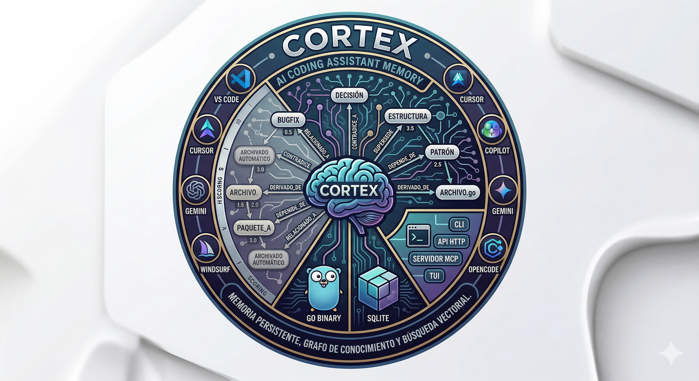

<p align="center">
  
</p>
<p align="center">
  <strong>AI Coding Assistant Memory Server V2</strong><br>
  <em>Persistent memory with knowledge graph, importance scoring, and vector search</em>
</p>

<p align="center">
  <a href="#installation">Installation</a> &bull;
  <a href="#quick-start">Quick Start</a> &bull;
  <a href="#architecture">Architecture</a> &bull;
  <a href="#migration-from-engram">Migration</a> &bull;
  <a href="CONTRIBUTING.md">Contributing</a>
</p>

---

> **cortex** — *neuroscience*: the outer layer of the brain responsible for higher-level processes like memory, attention, perception, and cognition.

Cortex is the next generation of AI coding assistant memory. Built on the foundation of [Engram](https://github.com/Gentleman-Programming/engram), it adds powerful features like knowledge graph relationships, importance scoring, auto-archival, and optional vector search while maintaining full compatibility with Engram's API.

A **Go binary** with SQLite + FTS5 full-text search + Knowledge Graph, exposed via CLI, HTTP API, MCP server, and an interactive TUI. Works with **any agent** that supports MCP — Claude Code, OpenCode, Gemini CLI, Codex, VS Code (Copilot), Antigravity, Cursor, Windsurf, or anything else.

```
Agent (Claude Code / OpenCode / Gemini CLI / Codex / VS Code / Antigravity / ...)
    ↓ MCP stdio
Cortex (single Go binary)
    ↓
SQLite + FTS5 + Knowledge Graph (~/.cortex/cortex.db)
```

## Key Features

### Core Memory (from Engram)
- **Full-Text Search (FTS5)** — Lightning-fast search across all observations
- **Session Tracking** — Automatic session management with context aggregation
- **Topic Keys** — Upsert semantics for evolving observations (architecture decisions, etc.)
- **Passive Capture** — Extract learnings from agent output automatically
- **Deduplication** — Intelligent content-based deduplication with configurable window

### New in V2 (Cortex)
- **Knowledge Graph** — Relate observations with typed relationships (related_to, contradicts, supersedes, depends_on, derived_from)
- **Entity Linking** — Extract and link files, packages, symbols, URLs, and concepts
- **Importance Scoring** — Automatic scoring based on type weight, time decay, and reference counting
- **Auto-Archival** — Automatically archive low-importance, old observations
- **Vector Search** — Optional hybrid search combining FTS5 with embedding similarity (via sqlite-vec)
- **Graph Traversal** — Navigate the knowledge graph starting from any observation
- **Enhanced Configuration** — YAML config with environment variable overrides

## Installation

### Homebrew (macOS/Linux)

```bash
brew install lleontor705/tap/cortex
```

### Pre-built Binaries

Download from [Releases](https://github.com/lleontor705/cortex/releases):

```bash
# Linux
curl -sSL https://github.com/lleontor705/cortex/releases/latest/download/cortex-linux-amd64 -o cortex
chmod +x cortex

# macOS
curl -sSL https://github.com/lleontor705/cortex/releases/latest/download/cortex-darwin-amd64 -o cortex
chmod +x cortex

# Windows (PowerShell)
Invoke-WebRequest -Uri https://github.com/lleontor705/cortex/releases/latest/download/cortex-windows-amd64.exe -OutFile cortex.exe
```

### Build from Source

```bash
git clone https://github.com/lleontor705/cortex.git
cd cortex
go build -o cortex ./cmd/cortex
```

## Quick Start

### Setup Your Agent

| Agent | One-liner |
|-------|-----------|
| Claude Code | `cortex setup claude-code` |
| OpenCode | `cortex setup opencode` |
| Gemini CLI | `cortex setup gemini-cli` |
| Codex | `cortex setup codex` |
| VS Code | `code --add-mcp '{"name":"cortex","command":"cortex","args":["mcp"]}'` |
| Cursor / Windsurf / Any MCP | See [docs/AGENT-SETUP.md](docs/AGENT-SETUP.md) |

### Basic Usage

```bash
# Start MCP server (stdio)
cortex mcp

# HTTP server status
cortex serve
# prints a clear "not implemented yet" message in this phase

# Search memories
cortex search "JWT auth middleware"

# Save a memory
cortex save "Switched to JWT" "**What**: Replaced session auth with JWT" --type decision --project myapp

# View recent context
cortex context myapp

# Launch TUI
cortex tui
```

That's it. No Node.js, no Python, no Docker. **One binary, one SQLite file.**

## Architecture

```
1. Agent completes significant work (bugfix, architecture decision, etc.)
2. Agent calls mem_save → title, type, What/Why/Where/Learned
3. Cortex persists to SQLite with FTS5 indexing + importance scoring
4. Optional: Agent relates observations via knowledge graph
5. Next session: agent searches memory, gets relevant context + related observations
```

### Data Model

#### Observations
The primary data unit with auto-increment ID, type, title, content, project, scope, and metadata:
- **Deduplication** — SHA-256 hash of normalized content
- **Topic Keys** — Upsert semantics for evolving topics
- **Importance Score** — Computed from type weight, time decay, reference count

#### Knowledge Graph
- **Relationships** — Connect observations with typed edges
- **Entities** — Extract files, packages, symbols, URLs, concepts
- **Traversal** — Navigate the graph with depth control

### Importance Scoring

Each observation has a computed importance score:

```
score = base_weight × time_decay × reference_factor

base_weight: architecture=1.5, decision=1.3, pattern=1.1, config=1.0, 
             discovery=0.9, bugfix=0.8, learning=0.7, manual=0.5, passive=0.4

time_decay = 0.5^(age_in_days / half_life_days)  [default half_life=30d]

reference_factor = 1 + log(1 + reference_count)
```

### Auto-Archival

Low-importance observations are automatically archived:
- Default threshold: `score < 0.1` AND `age > 90 days`
- Archived observations moved to separate table
- Search can include archived items with `include_archived=true`

## MCP Tools

### Core Tools (Engram-Compatible)

| Tool | Purpose |
|------|---------|
| `mem_save` | Save observation with What/Why/Where/Learned format |
| `mem_update` | Update observation by ID |
| `mem_delete` | Soft or hard delete |
| `mem_suggest_topic_key` | Generate stable key for evolving topics |
| `mem_search` | Full-text search with filters |
| `mem_context` | Recent session context aggregation |
| `mem_timeline` | Chronological drill-in around observation |
| `mem_get_observation` | Get full content by ID |
| `mem_save_prompt` | Save user prompt for context |
| `mem_stats` | Memory statistics |
| `mem_session_start` | Register session start |
| `mem_session_end` | Mark session complete |
| `mem_capture_passive` | Extract learnings from agent output |

### Cortex-Exclusive Tools

| Tool | Purpose |
|------|---------|
| `mem_relate` | Create relationship between observations |
| `mem_graph` | Traverse knowledge graph from observation |
| `mem_score` | Get importance score of observation |
| `mem_archive` | Manually archive observation |
| `mem_search_hybrid` | Hybrid FTS5 + vector search (requires sqlite-vec) |

Full tool reference → [docs/MCP-TOOLS.md](docs/MCP-TOOLS.md)

## Configuration

Cortex reads configuration from `~/.cortex/config.yaml` with environment variable overrides:

```yaml
database:
  path: ~/.cortex/cortex.db
  wal: true
  busy_timeout: 5000

http:
  port: 7437
  auth:
    token: ""  # Optional auth token

search:
  default_limit: 20
  max_limit: 100
  fts5: true
  vector: false  # Enable sqlite-vec
  fusion_k: 60   # RRF fusion parameter

memory:
  max_observation_length: 50000
  dedupe_window: 15m
  auto_archive_days: 90
  importance_decay_half_life: 30d
  min_archive_score: 0.1

lifecycle:
  enable_auto_archive: true
  archive_check_interval: 1h

logging:
  level: info  # debug, info, warn, error
  format: text  # text, json
```

### Environment Variables

All config values can be overridden with `CORTEX_` prefixed environment variables:

```bash
export CORTEX_DATABASE_PATH=/custom/path.db
export CORTEX_HTTP_PORT=9090
export CORTEX_MEMORY_DEDUPE_WINDOW=30m
```

See [docs/CONFIGURATION.md](docs/CONFIGURATION.md) for full reference.

## CLI Reference

| Command | Description |
|---------|-------------|
| `cortex serve` | Report HTTP server status; currently fails fast until HTTP is implemented |
| `cortex mcp [--tools=PROFILE]` | Start MCP server (stdio) |
| `cortex tui` | Launch terminal UI |
| `cortex search <query> [flags]` | Search memories |
| `cortex save <title> <content> [flags]` | Save a memory |
| `cortex timeline <obs_id> [flags]` | Chronological context |
| `cortex context [project] [flags]` | Recent session context |
| `cortex stats` | Memory statistics |
| `cortex export [file]` | Export to JSON |
| `cortex import <file>` | Import from JSON |
| `cortex import --from-engram --path <engram.db>` | Import directly from an Engram SQLite database |
| `cortex setup <agent>` | Install agent integration |
| `cortex version` | Show version |

## Migration from Engram

Cortex provides seamless migration from Engram:

```bash
# Import from custom location
cortex import --from-engram --path /path/to/engram.db
```

### What's Preserved

✅ All sessions, observations, and prompts
✅ FTS5 indexes automatically rebuilt through Cortex migrations
✅ Importance scores calculated for all observations
✅ Topic keys and deduplication hashes
✅ Soft-deleted observations

### What's New

- **Importance scoring** applied to all imported observations
- **Reference counting** starts at 0 for imported data
- **Knowledge graph** ready for new relationships

See [docs/MIGRATION.md](docs/MIGRATION.md) for detailed migration guide.

## Terminal UI

```bash
cortex tui
```

Interactive terminal interface for browsing, searching, and managing memories. Features:
- Vim-style navigation (`j/k`, `Enter`, `Esc`)
- Search with `/`
- Observation detail view
- Relationship graph visualization
- Catppuccin Mocha theme

## Development

### Prerequisites

- Go 1.21 or later
- SQLite3 with FTS5 support
- (Optional) sqlite-vec for vector search

### Building

```bash
# Development build
go build -o cortex ./cmd/cortex

# Production build (optimized)
go build -ldflags="-s -w" -o cortex ./cmd/cortex

# Run tests
go test ./...

# Run tests with coverage
go test -cover ./...

# Run integration tests
go test -tags=integration ./...
```

### Project Structure

```
cortex/
├── cmd/
│   └── cortex/           # CLI entry point
├── internal/
│   ├── store/            # SQLite storage layer
│   ├── search/           # FTS5 + vector search
│   ├── graph/            # Knowledge graph
│   ├── lifecycle/        # Importance scoring, archival
│   ├── mcp/              # MCP server implementation
│   ├── http/             # HTTP API
│   ├── config/           # Configuration management
│   └── tui/              # Terminal UI
├── migrations/           # Database migrations
├── docs/                 # Documentation
└── skills/               # AI agent skills
```

### Running Migrations

```bash
# Apply pending migrations
cortex migrate

# Check current version
cortex migrate --version

# Rollback (if reversible)
cortex migrate --down --target 3
```

## Testing

Cortex maintains >= 70% test coverage:

```bash
# Unit tests
go test ./...

# With coverage report
go test -coverprofile=coverage.out ./...
go tool cover -html=coverage.out

# Integration tests (requires SQLite)
go test -tags=integration ./...

# Benchmarks
go test -bench=. ./internal/search
```

## Performance

- **FTS5 Search**: Sub-10ms for typical queries on 10K+ observations
- **Memory Usage**: ~20MB baseline, scales linearly with data
- **Binary Size**: ~15MB (compressed with UPX)
- **Startup Time**: <100ms for MCP server

## Documentation

| Doc | Description |
|-----|-------------|
| [MCP Tools Reference](docs/MCP-TOOLS.md) | Complete tool documentation |
| [Configuration Guide](docs/CONFIGURATION.md) | All config options explained |
| [Migration Guide](docs/MIGRATION.md) | Migrating from Engram |
| [Architecture](docs/ARCHITECTURE.md) | Technical architecture details |
| [Contributing](CONTRIBUTING.md) | Contribution workflow |

## Comparison with Engram

| Feature | Engram | Cortex |
|---------|--------|--------|
| FTS5 Search | ✅ | ✅ |
| Session Tracking | ✅ | ✅ |
| Topic Keys | ✅ | ✅ |
| Passive Capture | ✅ | ✅ |
| Knowledge Graph | ❌ | ✅ |
| Importance Scoring | ❌ | ✅ |
| Auto-Archival | ❌ | ✅ |
| Vector Search | ❌ | ✅ (optional) |
| Entity Linking | ❌ | ✅ |
| MCP Compatibility | ✅ | ✅ (100%) |

## License

MIT

---

**Built on the foundation of [Engram](https://github.com/Gentleman-Programming/engram)** — Enhanced with knowledge graph, importance scoring, and vector search for the next generation of AI coding assistants.
