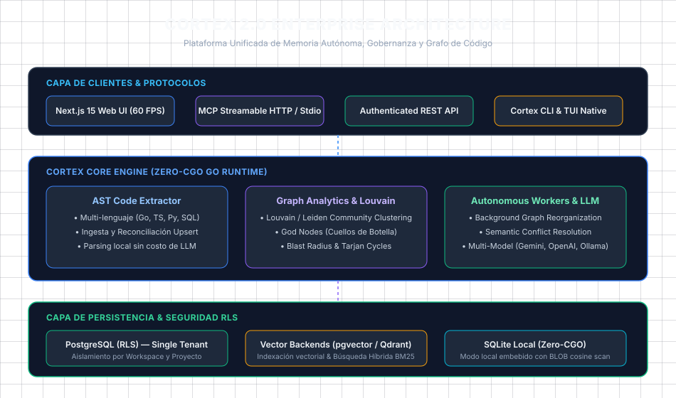
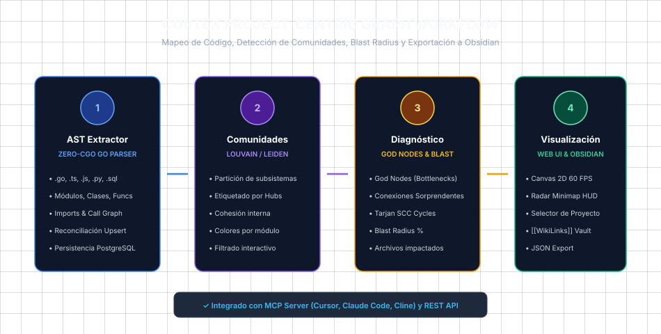
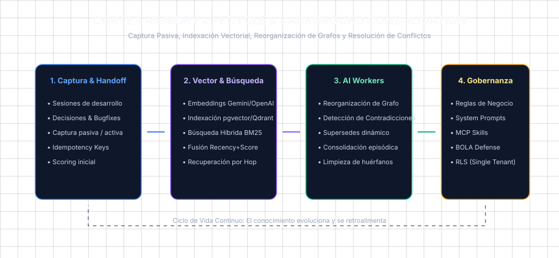

# 🧠 Cortex: Autonomous AI Memory & Project Knowledge Graph

**English** | [Español](README.es.md)

<p align="center">
  
</p>

<p align="center">
  <a href="https://github.com/lleontor705/cortex/actions/workflows/ci.yml"></a>
  <a href="https://pkg.go.dev/github.com/lleontor705/cortex/v2"></a>
  <a href="LICENSE"></a>
  <a href="https://lleontor705.github.io/cortex/"></a>
</p>

<p align="center">
  <a href="https://go.dev/"></a>
  <a href="web/"></a>
  <a href="docs/SERVER.md"></a>
  <a href="docs/MCP.md"></a>
  <a href="https://pkg.go.dev/github.com/lleontor705/cortex/v2"></a>
</p>

📖 **Documentation site:** [https://lleontor705.github.io/cortex/](https://lleontor705.github.io/cortex/)

**Cortex** is a self-hosted platform for **autonomous episodic memory, project governance, and a code knowledge graph** built for AI agents (Cursor, Claude Code, Cline, Windsurf) and development teams.

It combines Zero-CGO static AST code extraction (.NET C#/F#/VB, Java, Kotlin, Rust, C/C++, PHP, Ruby, Swift, Go, TS/JS, Python, SQL), community clustering (Louvain/Leiden), blast-radius analysis, project governance, hybrid search (BM25 + vectors), and secure persistence backed by single-instance self-hosted PostgreSQL and local SQLite.

---

## ⚡ Key Capabilities

### 1. 🌐 Per-Project Code & Knowledge Graph (Graphify-style)
- **Native Polyglot AST Extractor (Zero-CGO):** Analyzes code in pure Go for **.NET** (`.cs`, `.fs`, `.vb`), **Java/Kotlin** (`.java`, `.kt`), **Rust** (`.rs`), **C/C++** (`.c`, `.cpp`, `.h`, `.hpp`), **PHP** (`.php`), **Ruby** (`.rb`), **Swift** (`.swift`), **TypeScript/JavaScript** (`.ts`, `.tsx`, `.js`), **Python** (`.py`), **Go** (`.go`), and **SQL** (`.sql`) without sending code to external LLMs or spending API tokens.
- **Community Clustering (Louvain/Hubs):** Automatically groups the functional subsystems of a project and labels architectural hubs.
- **God Nodes & Cycle Detection:** Identifies bottlenecks (`in_degree`/`out_degree`) and circular dependencies (Tarjan SCC).
- **Blast Radius:** Measures the percentage impact and lists the affected files/functions when any component changes.
- **Incremental Reconciliation on Refactors:** If file `A` previously depended on `B` and now depends on `B` and `C`, Cortex updates and reconciles the relationships instantly.
- **Obsidian Vault Exporter:** Downloads interlinked Markdown notes with `[[WikiLinks]]`.

<p align="center">
  
</p>

### 2. 🧠 Episodic Memory & Continuous Learning
- Records architecture decisions, bug fixes, patterns, and technical discoveries.
- **Smart Hybrid Search:** Combines full-text BM25 with vector similarity (OpenAI, Ollama, pgvector, Qdrant) plus freshness/importance weighting.
- **Autonomous Background Workers:** Periodic graph reorganization, contradiction detection, and conflict resolution (`supersedes`).

<p align="center">
  
</p>

### 3. 🛡️ Project Governance & Self-Hosting
- **Self-Hosted PostgreSQL (Single-Instance RLS):** The single-tenant server pins `tenant_id` and `workspace_id` from configuration and runs every operation under forced RLS.
- **Project Rules & System Prompts:** Dynamic injection of corporate rules and skills into every agent query.

---

## 📦 Installation

Every channel installs the same `cortex` binary. The full channel matrix — Homebrew, Go toolchain, checksum-verified release binaries, source builds, and the multi-arch container image — is documented in **[docs/distribution.md](docs/distribution.md)**.

### Homebrew (macOS / Linux)

```bash
brew install lleontor705/tap/cortex
```

### Go Install (Cross-platform)

```bash
go install github.com/lleontor705/cortex/v2/cmd/cortex@latest
```

### Prebuilt Binaries & Source Builds

Download prebuilt binaries (Windows, macOS, Linux) from [GitHub Releases](https://github.com/lleontor705/cortex/releases), or build locally from source (see [docs/distribution.md](docs/distribution.md#build-from-source)):

```bash
git clone https://github.com/lleontor705/cortex.git
cd cortex
make build
```

---

## 🚀 Quick Start

### 1. Local Mode (SQLite, CLI & TUI)

```bash
# Set up automatic integration with modular profiles (dev, minimal, agent)
cortex setup claude-code --profile=dev
cortex setup opencode --profile=agent

# Show the operating mode (local, hybrid, server)
cortex status

# Diagnose the database and indexes
cortex doctor

# Adaptive search with complexity classification
cortex search "architecture decision" --mode=auto

# Index a repository once (AST symbols and relations)
cortex ingest ./internal --project cortex

# Keep the index fresh with the continuous file watcher daemon
cortex watch . --project cortex

# Snapshot the local SQLite database before risky operations
cortex backup ~/backups/cortex.db

# Check for a newer release without installing it
cortex update --check

# Launch the interactive terminal UI (with an integrated profile selector)
cortex tui
```

### 2. Embedded Web UI & Server Mode

The web UI is compiled into the `cortex` binary and served on the **same host and
port as the HTTP API**. There is no separate web container or second port: the UI
ships inside the server image.

#### Local (single binary, SQLite)

```bash
cortex serve
```

On the first boot Cortex prints the web access key **once**. Open
[http://localhost:7438](http://localhost:7438), paste the key into the UI, and it
is remembered in the browser. Later rotations use:

```bash
cortex web key show        # location, presence, and prefix (never the plaintext)
cortex web key regenerate  # mint a replacement and print it once
```

See [Embedded Web UI](docs/embedded-web.md) for the at-rest key format (0600,
prefix + HMAC digest), rotation semantics, runtime `/config.js` endpoint
injection, and the per-mode (`local`/`hybrid`/`server`) capabilities.

The local `serve` mux also serves the five web-critical parity endpoints
(`/api/me`, `/api/stats`, `/api/projects`, `/api/agent/projects`,
`/api/graph/project-graph`) behind the same `http.token` gate.

#### Server mode (self-hosted, single-tenant PostgreSQL)

```bash
cortex --mode server
```

`--mode server` runs the self-hosted single-tenant composition: a PostgreSQL 16+
backing store with one static bearer (`http.token`) authenticating a synthetic
constant principal assembled from `server.tenant_id`, `server.workspace_id`, and
`server.principal_subject`. It serves the same embedded UI at `/`, the
authenticated REST API at `/api/`, and Streamable HTTP MCP at `/mcp`; the web
access key stays an independent UI credential.

The official image runs the same binary. The bundled Compose stack brings up
PostgreSQL plus the server (UI and API on `:7438`):

```bash
# 1. Configure environment variables (optional)
cp .env.example .env

# 2. Start PostgreSQL + Cortex server
docker compose up -d
```

> [!TIP]
> On first boot the server prints the web access key once; paste it into the UI. To
> read it from the container logs run:
> ```bash
> docker compose logs cortex-server
> ```

---

## 🔌 MCP Agent Integration (Cursor, Claude Code, Cline)

Add Cortex as an MCP server in your editor or agent:

### MCP configuration (Streamable HTTP):

```json
{
  "mcpServers": {
    "cortex": {
      "url": "https://your-cortex-server.railway.app/mcp",
      "headers": {
        "Authorization": "Bearer YOUR_BEARER_TOKEN"
      }
    }
  }
}
```

### Modular Profiles and MCP Tools:
Cortex organizes its catalog into modular profiles (`--tools=agent|dev|minimal`):
- **Episodic Memory & Search:** `cortex_save`, `cortex_update`, `cortex_get_observation`, `cortex_context`, `cortex_session_summary`, `cortex_search` (FTS5 + Vectors + HippoRAG + Adaptive-RAG), `cortex_get_agent_context`.
- **Knowledge Graph & Lineage:** `cortex_relate`, `cortex_graph`, `cortex_graph_path`, `cortex_revision_history`, `cortex_handoff` (idempotent handoff between agents).
- **AST Code Intelligence (Zero-CGO):** `cortex_ingest_code` (native polyglot static extraction), `cortex_get_code_symbols`, `cortex_code_map` (PageRank repo map), `cortex_code_tests` (Fast-TDD test impact), `cortex_get_blast_radius`, `cortex_detect_cycles`, `cortex_analyze_architecture`.
- **Governance & Status:** `cortex_get_rules`, `cortex_save_rule`, `cortex_get_status` (SQLite/Postgres mode and capabilities). In Server mode also: `cortex_get_project_context`, `cortex_list_skills`, `cortex_get_skill`, `cortex_resolve_query`.

---

## 📚 Documentation

📚 **Docs site:** [https://lleontor705.github.io/cortex/](https://lleontor705.github.io/cortex/)

- [Graph & AST Intelligence Guide](docs/GRAPH_INTELLIGENCE.md)
- [MCP Tool Catalog](docs/MCP.md)
- [HTTP REST API Reference](docs/HTTP-API.md)
- [System Architecture](docs/ARCHITECTURE.md)
- [Multi-Format Configuration](docs/CONFIGURATION.md)
- [Obsidian Export](docs/OBSIDIAN_EXPORT.md)
- [Production Deployment (Server & Docker)](docs/SERVER.md)
- [Embedded Web UI & Key Lifecycle](docs/embedded-web.md)
- [Installation Channels & Distribution](docs/distribution.md)
- [Installation Guide](docs/INSTALLATION.md)
- [CLI Reference](docs/CLI-REFERENCE.md)
- [Benchmarks & Measured Results](docs/BENCHMARKS.md)

---

## 🛠️ Development Commands

```bash
# Download dependencies and build the binary
go mod download
make build

# Run the unit and integration test suite
go test -v -count=1 ./...

# Official linter
golangci-lint run ./...

# Build and embed the web assets BEFORE make build (see docs/embedded-web.md)
make web-build
```

---

<p align="center">
  <b>Cortex 2.0</b> • Built to make AI-assisted software development durable and reliable.<br/>
  Also available in <a href="README.es.md">Español</a>.
</p>
