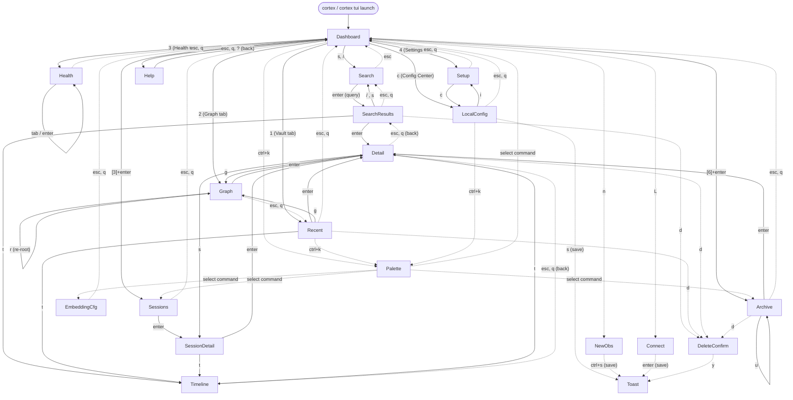

# Guía de la TUI de Cortex

La interfaz de terminal de Cortex (TUI) es la superficie interactiva keyboard-first
sobre el store de memoria SQLite local. Se distribuye dentro del binario `cortex` y
está construida sobre Bubble Tea + Lip Gloss. Esta es la primera guía de usuario de
esa superficie: cubre cómo lanzarla, qué es cada pantalla y overlay, el mapa
completo de teclas, la paleta de comandos, el motor de temas, la barra de estado y
el Command Deck, flujos de trabajo orientados a tareas, cómo se relaciona la TUI
con la CLI y con MCP, y las peculiaridades conocidas que encontrarás.

Todo lo de abajo fue verificado contra el código aterrizado en `internal/tui` y el
wiring de lanzamiento en `cmd/cortex/main.go` y `internal/cli/cli.go`. Donde el
comportamiento es sorprendente está verificado contra el código, no contra la ayuda
de la app.

---

## 1. Resumen

- **Runtime**: programa Bubble Tea iniciado por `internal/cli.runTUIReal` y
  construido por `tui.NewWithScreen(deps, initialScreen)`.
- **Datos**: la TUI está conectada al mismo bundle de dependencias
  (`internal/store/bundle`) que usan la CLI local y el servidor MCP local. Ver
  sección 8.
- **Modelo**: un único `tui.Model` contiene la `Screen` activa, el cursor,
  componentes de lista, modelos de input, estado del tema y flags modales. El enum
  de pantallas vive en `internal/tui/model.go`.
- **Pantallas vs overlays**: las pantallas reemplazan todo el cuerpo; los overlays
  son paneles centrados o anclados abajo dibujados encima de la pantalla actual
  sin descargarla.

El enum de pantallas tiene **exactamente 15 pantallas** y la capa de vista dibuja
**5 overlays**.

---

## 2. Lanzar la TUI

### 2.1 `cortex tui`

```bash
cortex tui            # open on the Dashboard
cortex tui --config   # open directly on the Configuration Center (Local Settings)
```

`--config` solo fija la pantalla inicial a `tui.ScreenLocalConfig`. No cambia desde
dónde se carga la configuración.

### 2.2 Invocación desnuda desde un terminal interactivo

Ejecutar `cortex` sin comando en un terminal interactivo lanza la TUI en el
Dashboard. `cmd/cortex/main.go` comprueba si stdout **y** stdin son TTYs
(`isInteractive`); cuando lo son y no se dio ningún comando, inyecta el argumento
`tui` antes de despachar a `cli.Run`. Esto es lo que hace que doble-clic en el
binario de Windows abra la UI en lugar de imprimir la ayuda.

### 2.3 Asistente de configuración

```bash
cortex config wizard          # TUI on a TTY, CLI wizard when piped
cortex config wizard --tui    # force the TUI Configuration Center
cortex config wizard --cli    # force the text wizard
```

`runConfigWizard` elige la TUI cuando se pasa `--tui`, o cuando `--cli` está
ausente y stdout es una terminal. Delega a `cortex tui --config`.

### 2.4 Fallback no interactivo

Cuando stdout o stdin **no** es una terminal (CI, pipes, salida redirigida), el
binario desnudo **no** lanza la TUI. Sin comando, `cli.Run` imprime el texto de uso
y sale con código `1`. La configuración por script debe usar los subcomandos
(`cortex config get|set|show|validate|init`) o `cortex config wizard --cli`; la TUI
nunca se auto-inicia en un contexto no interactivo.

### 2.5 Salir

- `ctrl+c` sale inmediatamente desde cualquier sitio (hard quit).
- `q` sale desde el Dashboard y actúa como "atrás" en la mayoría de las demás
  pantallas.
- `esc` es "atrás" en la mayoría de pantallas.

---

## 3. Mapa de pantallas y navegación

### 3.1 Mapa de pantallas Mermaid



Los edges discontinuos son overlays o navegación hacia atrás; los edges sólidos son
transiciones primarias hacia adelante.

### 3.2 Inventario de pantallas (15 pantallas)

| # | Pantalla (valor `Screen`) | Título en la barra de estado | Rutas de entrada |
|---|---|---|---|
| 1 | `ScreenDashboard` | Dashboard | Pantalla inicial por defecto; paleta de comandos "Go to Dashboard"; atrás desde la mayoría de pantallas |
| 2 | `ScreenSearch` | Search | Dashboard `s` o `/`; paleta "Search memories"; SearchResults `/` o `s` |
| 3 | `ScreenSearchResults` | Search Results | Pulsa `enter` en una query no vacía en Search |
| 4 | `ScreenRecent` | Recent | Global `1` (workspace Vault); elemento de menú 2 del Dashboard + `enter` |
| 5 | `ScreenObservationDetail` | Detail | `enter` en un elemento de lista (Recent, SearchResults, Archive, Graph, Session Detail) |
| 6 | `ScreenTimeline` | Timeline | `t` desde Recent, SearchResults, Detail, Session Detail |
| 7 | `ScreenSessions` | Sessions | Elemento de menú 3 del Dashboard + `enter`; paleta "Browse sessions" |
| 8 | `ScreenSessionDetail` | Session Detail | `enter` en una sesión; `s` desde Detail |
| 9 | `ScreenSetup` | Setup | Global `4` (workspace Settings); paleta "Setup agent plugin"; Local Settings `i` |
| 10 | `ScreenGraph` | Graph | Global `2` (workspace Graph); Detail `g`; Recent `g`; paleta "Knowledge graph" |
| 11 | `ScreenArchive` | Archive | Elemento de menú 6 del Dashboard + `enter`; paleta "Archived observations" |
| 12 | `ScreenHealth` | Health | Global `3` (workspace Health); paleta "Memory health" |
| 13 | `ScreenEmbeddingConfig` | Embedding Settings | Solo paleta de comandos "Embedding settings" |
| 14 | `ScreenLocalConfig` | Local Settings | Dashboard `c`; `cortex tui --config`; paleta "Local settings"; Setup `c` |
| 15 | `ScreenHelp` | Help | `?` desde cualquier pantalla que no sea de input |

> No hay ninguna pantalla dedicada de "Models" ni "Usage Stats". La selección de
> modelo/proveedor vive en **Embedding Settings** (pantalla 13) y en la sección AI
> de **Local Settings** (pantalla 14); los conteos de observaciones, edges, sesiones
> y tipos de memoria se renderizan en el **Dashboard**. Esto coincide con el enum
> `Screen` en `internal/tui/model.go:30-46`.

### 3.3 Overlays (5)

| Overlay | Disparador | Descartar / actuar |
|---|---|---|
| Paleta de comandos | `ctrl+k` | escribe para filtrar; `up`/`ctrl+p`, `down`/`ctrl+n`, `enter` ejecuta; `esc` cierra |
| Quick Create Memory | `n` (Dashboard y pantallas de lista) | `tab`/`shift+tab` o `enter` para mover campos; `ctrl+s` o `enter` en Save; `esc` cancela |
| Connect to Server / Auth | `L` | `tab`/`↑↓` navegan; `space` conmuta el modo; `enter` guarda en YAML; `esc` cancela |
| Confirmación de borrado | `d` en una pantalla de lista/detalle | `y` confirma, `n`/`esc` cancela |
| Aviso toast / error | Cualquier acción que reporte éxito, warning o fallo | Transitorio: se limpia con la siguiente pulsación de tecla |

---

## 4. Matriz de keybindings

### 4.1 Teclas globales

Se enrutan antes de cualquier handler por pantalla (`internal/tui/update.go:601-745`)
y se suprimen en las pantallas de input de texto (`Search`, `Embedding Settings`,
`Local Settings`, `Help`) donde se indica.

| Tecla | Acción | Notas |
|---|---|---|
| `?` | Abrir Help | Suprimida en Search, Embedding, Local Settings, Help |
| `ctrl+k` | Abrir la paleta de comandos | Disponible en todas partes |
| `1` | Workspace Vault → Recent | Suprimida en pantallas de input |
| `2` | Workspace Graph → Graph | Misma supresión; carga el grafo de la observación reciente/primera |
| `3` | Workspace Health → Health | Misma supresión |
| `4` | Workspace Settings → Setup | Misma supresión |
| `n` | Modal Quick Create Memory | Suprimida en pantallas de input |
| `t` | Alternar tema (dark ↔ light) | Suprimida en pantallas de input |
| `L` | Conectar al servidor (modal de auth) | Suprimida en pantallas de input |
| `u` | Dashboard: alternar stats Personal ↔ Admin Global | Solo Dashboard |
| `P` | Alternar subida/sync ("Upload to Cortex") | Solo Dashboard y Local Settings |
| `p` | Ciclar filtro de proyecto | Dashboard, Recent, SearchResults, Graph, Sessions |
| `v` | Alternar panel de preview dividido | Recent, SearchResults, Archive |
| `ctrl+c` | Forzar salida | Siempre |
| `esc` / `q` | Atrás / salir | Manejado por pantalla; ver cada tabla |

### 4.2 Dashboard (`handleDashboardKeys`)

| Tecla | Acción |
|---|---|
| `up` / `k`, `down` / `j` | Mover el cursor del menú |
| `enter` / `space` | Activar el elemento de menú resaltado |
| `5`–`9` | Saltar directamente a los elementos de menú 5–9 (Memory health, Archived, Search memories, Local settings, Connect to server) |
| `s` o `/` | Abrir Search (input de query enfocado) |
| `r` | Saltar a Recent observations |
| `g` | Abrir el Knowledge Graph |
| `c` | Abrir el Configuration Center (Local Settings) |
| `i` | Abrir Setup (instalar plugin de agente) |
| `q` | Salir |
| `t`, `u`, `n`, `L`, `P` | Manejadas por el router global (tema, vista de stats, nueva memoria, conectar, sync) |

Los dígitos `1`–`4` se interceptan globalmente como **conmutadores de workspace**, y
los elementos de menú `[10]` y `[11]` no tienen binding de dígito. Ver la sección de
peculiaridades.

### 4.3 Search — input de query enfocado (`handleSearchInputKeys`)

| Tecla | Acción |
|---|---|
| `enter` | Ejecutar la query (búsqueda de memoria o búsqueda de código, según la fuente actual) |
| `tab` | Cambiar fuente: `Memories` ↔ `Code AST` |
| `f` | Ciclar el filtro de proyecto activo |
| `up` / `down` | Recorrer el historial de queries de la sesión (últimas 20 queries) |
| `esc` | Desenfocar y volver al Dashboard |
| cualquier otra tecla | Editar el texto de la query |

Cuando el input **no** está enfocado (`handleSearchKeys`): `esc`/`q` vuelve al
Dashboard, y `i` o `/` vuelve a enfocar el input.

### 4.4 Search Results (`handleSearchResultsKeys`)

| Tecla | Acción |
|---|---|
| `j` / `k` | Moverse por los resultados (lista de Bubble Tea) |
| `enter` | Abrir el detalle de la observación; en modo código, abrir la preview del símbolo |
| `t` | Timeline (solo en modo memoria) |
| `f` | Ciclar el filtro de proyecto y re-ejecutar la query |
| `d` | Borrar con confirmación (solo en modo memoria) |
| `/` o `s` | Iniciar una nueva búsqueda |
| `p` | **Sombreada** — el router global cicla primero el filtro de proyecto; ver peculiaridades |
| `v` | Alternar el panel de preview dividido |
| `esc` / `q` | Volver a Search |

### 4.5 Observation Detail (`handleObservationDetailKeys`)

| Tecla | Acción |
|---|---|
| `up` / `k`, `down` / `j` | Desplazar el viewport de contenido una línea |
| `pgup` / `pgdown` | Desplazamiento de media página |
| `t` | Timeline de esta observación |
| `g` | Abrir el Knowledge Graph enraizado en esta observación |
| `s` | Saltar a la sesión de la observación (cuando haya un session id) |
| `d` | Borrar con confirmación |
| `esc` / `q` | Volver a la pantalla anterior |

### 4.6 Graph (`handleGraphKeys`)

| Tecla | Acción |
|---|---|
| `j` / `k` | Moverse por las observaciones relacionadas |
| `enter` | Abrir el detalle de la observación |
| `r` | Re-enraizar el grafo en la observación seleccionada |
| `esc` / `q` | Atrás |

### 4.7 Archive (`handleArchiveKeys`)

| Tecla | Acción |
|---|---|
| `j` / `k` | Moverse por las observaciones archivadas |
| `enter` | Abrir el detalle de la observación |
| `u` | Restaurar (desarchivar) la observación seleccionada |
| `d` | Borrar con confirmación |
| `f` | Ciclar el filtro de proyecto |
| `esc` / `q` | Volver al Dashboard |

### 4.8 Health (`handleHealthKeys`)

| Tecla | Acción |
|---|---|
| `j` / `k` | Desplazarse |
| `tab` | Ciclar sección: Stale → Orphans → Consolidation |
| `enter` | Expandir / colapsar la sección actual |
| `esc` / `q` | Volver al Dashboard |

### 4.9 Embedding Settings (`handleEmbeddingConfigKeys`)

| Tecla | Acción |
|---|---|
| `j` / `k` | Moverse entre campos (Provider, Model, Vector, Auto-start, Save) |
| `h` / `l` (o `left` / `right`) | Ciclar el proveedor de embeddings |
| `space` | Alternar el checkbox enfocado (Vector, Auto-start) |
| `enter` | Editar el nombre del modelo, o Save cuando el botón Save está enfocado |
| `r` | Recargar la configuración desde disco |
| `x` | Reindexar todos los embeddings (disponible tras un Save cuando cambió el proveedor/modelo) |
| `s` | Post-save: arrancar Ollama cuando no está en marcha |
| `p` | Post-save: pull del modelo Ollama configurado cuando falta |
| `esc` / `q` | Volver al Dashboard |

### 4.10 Local Settings / Configuration Center (`handleLocalConfigKeys`)

| Tecla | Acción |
|---|---|
| `tab` / `shift+tab` | Moverse entre secciones (Storage, AI & LLM, HTTP API, MCP Proxy, Sync, Review) |
| `j` / `k` | Moverse entre campos |
| `h` / `l` (o `left` / `right`) | Ciclar la opción enfocada (formato, proveedor, perfil MCP) |
| `enter` | Editar un campo de texto, ciclar una opción, o Save cuando el botón Save está enfocado |
| `space` | Alternar/ciclar el control enfocado (formato, proveedor, HTTP, perfil, remote, sync) |
| `t` | Probar la conexión LLM configurada |
| `i` | Saltar a Setup (plugins de agente) |
| `s` | Validar y guardar la configuración en disco |
| `r` | Recargar desde disco |
| `esc` / `q` | Volver al Dashboard |

### 4.11 Setup — plugins de agente (`handleSetupKeys`)

| Tecla | Acción |
|---|---|
| `j` / `k` | Moverse por los agentes detectados |
| `enter` | Instalar el plugin del agente seleccionado |
| `p` | Ciclar el perfil de instalación: agent (22 tools) → dev (11 tools) → minimal (5 tools) |
| `c` | Saltar a Local Settings (Configuration Center) |
| `y` / `n` | Responder al prompt de allowlist de Claude Code tras la instalación |
| `enter` / `esc` / `q` | Salir de la pantalla de resultado post-instalación |
| `esc` / `q` | Volver al Dashboard |

---

## 5. Paleta de comandos

Ábrela con `ctrl+k`. Escribe para filtrar por nombre de comando (substring
insensible a mayúsculas), `up` / `ctrl+p` y `down` / `ctrl+n` mueven el cursor,
`enter` ejecuta el comando resaltado y `esc` cierra la paleta. La paleta está
definida por `allCommands()` en `internal/tui/update.go` y se renderiza en
`internal/tui/view_modals.go`.

| Comando | Pista de shortcut | Efecto |
|---|---|---|
| Search memories | `/` | Abrir Search con el input de query enfocado |
| Recent observations | — | Abrir Recent |
| Browse sessions | — | Abrir Sessions |
| Knowledge graph | — | Abrir Graph |
| Memory health | — | Abrir Health |
| Archived observations | — | Abrir Archive |
| Embedding settings | — | Abrir Embedding Settings |
| Local settings | — | Abrir el Configuration Center |
| Connect to server | `L` | Abrir el modal de auth/conexión |
| Setup agent plugin | — | Abrir Setup |
| Help / Keyboard shortcuts | `?` | Abrir la pantalla de Help |
| Go to Dashboard | — | Volver al Dashboard y recargar stats |

---

## 6. Motor de temas

### 6.1 Cómo funciona

- Dos paletas están definidas en `internal/tui/styles.go`: `darkPalette`
  (base `#090d16`) y `lightPalette` (base `#f8fafc`). Cada una mapea los mismos
  colores semánticos (background, panel, text, cyan, blue, purple, green, amber,
  red, mauve, teal, gold, highlight).
- `ApplyTheme(dark bool)` selecciona una paleta, copia sus colores en las variables
  de color del paquete y reconstruye cada estilo de Lip Gloss vía `rebuildStyles()`.
- `ToggleTheme()` conmuta el modo actual y devuelve el nuevo estado; `IsDark()` lo
  reporta.
- La tecla `t` llama a `ToggleTheme()`, actualiza el badge de tema del modelo y
  muestra un toast `Theme: Dark Mode activated` /
  `Theme: Light Mode activated`.

### 6.2 Comportamiento de persistencia — **no persiste**

El tema es **solo de sesión**. No hay ninguna clave de tema en el modelo de
configuración ni ninguna vía de escritura para la elección de tema:
`internal/config` no tiene campo de tema, y ni el modal de auth ni el guardado de
Local Settings tocan uno. En cada arranque la TUI es oscura
(`Model.IsDarkTheme: true`, `currentIsDark = true`).

### 6.3 Verificar la persistencia

1. Lanza `cortex tui` y lee la barra de estado: muestra `🌙 Dark`.
2. Pulsa `t`. El toast dice `Theme: Light Mode activated` y la barra de estado
   cambia a `☀️ Light`.
3. Sal (`ctrl+c` o `q` desde el Dashboard) y relanza `cortex tui`.
4. Observa de nuevo `🌙 Dark` — la selección clara **no** sobrevivió al reinicio.
5. Opcionalmente confirma la ausencia de una clave persistida:
   `cortex config show` no tiene ninguna entrada de tema.

Este es el comportamiento documentado y observado. No esperes que una preferencia de
tema se restaure entre reinicios.

---

## 7. Barra de estado y Command Deck

### 7.1 Anatomía de la barra de estado

`renderStatusBar` (`internal/tui/view.go`) construye la barra inferior de izquierda
a derecha:

| Segmento | Ejemplo | Significado |
|---|---|---|
| Nombre de pantalla | `Search Results` | Nombre legible de la pantalla activa |
| Badge de usuario | `👤 alice [ADMIN]` | `CurrentUser` (desde `USER`/`USERNAME` o el principal configurado) y el rol en mayúsculas |
| Badge de tema | `🌙 Dark` / `☀️ Light` | Modo de tema actual |
| Posición en la lista | `[3/42]` | Índice seleccionado / total de elementos (solo Recent, SearchResults, Sessions, Graph, Archive) |
| Conteo de observaciones | `1024 obs` | Total de observaciones (solo modo full) |
| Filtro de proyecto | `prj: cortex` | Mostrado solo cuando hay un filtro de proyecto activo |
| Estado de preview | `preview: on` | Mostrado solo cuando la preview dividida está visible |
| Estado de sync | `sync: on` / `local only` | Si "Upload to Cortex" está habilitado |
| Versión | `v2.x.y` | Versión del binario cuando se conoce |
| Ayuda contextual | `j/k nav • enter select • …` | El Dashboard recibe una pista de menú; otras pantallas reciben la pista estándar `n new • t theme • L login • ? help • Esc back` |

Los mensajes de error y los toasts se renderizan justo encima de la barra de estado,
no dentro de ella.

### 7.2 Cabecera del Command Deck

`renderDeckHeader` (`internal/tui/view_header.go`) se dibuja en cada pantalla
**excepto el Dashboard** y se oculta en modo compacto. Su anatomía:

- **Fila de marca**: `CORTEX` + versión, seguida de
  `user (role) • local|cloud sync • dark|light`.
- **Tabs de workspace**: `[1] Vault`, `[2] Graph`, `[3] Health`, `[4] Settings`, con
  el tab activo resaltado. Estos son los mismos conmutadores globales `1`–`4`.
- **Separador**: una regla horizontal del tamaño de la terminal.

### 7.3 Modo compacto

`isCompact()` devuelve true cuando `Width < 60` o `Height < 20`. En modo compacto:

- La cabecera del Command Deck no se dibuja.
- La barra de estado se reduce al nombre de pantalla, el badge de usuario, el badge
  de tema y la posición en la lista (unidos con `|`).
- El ancho del Dashboard se limita a 100 columnas, y la preview dividida se
  deshabilita cuando la terminal tiene menos de 100 columnas al redimensionar.

---

## 8. Flujos de trabajo e interacción CLI/TUI/MCP

### 8.1 Capturar una memoria

1. Pulsa `n` desde el Dashboard o cualquier pantalla de lista. El modal Quick Create
   Memory se abre en el campo Title.
2. Escribe el título; `tab`/`shift+tab` (o `enter`) mueven a Content, Type, Project,
   Save. Type usa por defecto `decision`; Project usa por defecto el filtro activo
   (si no, `default`).
3. Pulsa `ctrl+s` o `enter` en Save. Aparece un toast `Memory created: <title>` y se
   refrescan Recent observations + stats.

### 8.2 Buscar en memoria, y después en código

1. Dashboard → `s` (o `/`). La pantalla Search muestra `Source: Memories`.
2. Escribe una query y pulsa `enter`. Los resultados aterrizan en Search Results.
3. Pulsa `tab` en la pantalla Search para cambiar `Source:` a `Code AST` y repite
   `enter` para buscar símbolos indexados en lugar de memorias.
4. `enter` en un resultado abre Detail; desde allí `t` muestra la timeline de la
   sesión y `g` abre el grafo enraizado en esa observación. `esc` retrocede.

### 8.3 Filtrar por proyecto

El ciclador global es `p` (Dashboard, Recent, SearchResults, Graph, Sessions). También
funciona como `f` en el input de Search y en las pantallas SearchResults / Recent /
Archive. Un toast `Filter project: <name>` confirma cada cambio y las listas
afectadas se re-consultan.

### 8.4 Previsualizar un resultado

En Recent, SearchResults y Archive pulsa `v` para alternar el panel de preview
dividido a la derecha; `j`/`k` actualizan su contenido. `v` lo apaga de nuevo. (La
tecla `p` documentada en algún texto de ayuda está sombreada — ver peculiaridades.)

### 8.5 Borrar una observación

Pulsa `d` en un resultado de búsqueda, un elemento reciente, una vista de detalle o
un elemento del archivo. Un modal de confirmación centrado muestra el título; `y`
borra y muestra el toast `Observation #N deleted`, `n` o `esc` cancela. Cualquier
otra tecla también cancela la confirmación.

### 8.6 Setup de embeddings y reindex

1. Abre la paleta de comandos (`ctrl+k`) y elige **Embedding settings**.
2. `j`/`k` hasta el campo Provider y `h`/`l` para ciclar `none` / `ollama` /
   `openai`.
3. `space` conmuta la búsqueda vectorial y el auto-start de Ollama; `enter` en el
   campo Model edita el nombre del modelo.
4. `enter` en Save escribe la configuración. Si cambió el proveedor o el modelo,
   aparece un warning
   `Provider/model changed — existing embeddings may be stale`.
5. Pulsa `x` para reindexar todas las observaciones; una barra de progreso reporta
   la finalización.
6. Cuando Ollama está seleccionado, las teclas post-save `s` (arrancar Ollama) y
   `p` (pull del modelo) aparecen según su estado de ejecución/modelo.

### 8.7 Configuration center

Pulsa `c` desde el Dashboard (o `cortex tui --config`). Muévete por las seis
secciones con `tab`/`shift+tab`, edita campos con `enter`, conmuta con `space`,
prueba el endpoint LLM con `t` y guarda con `s`. Aparece un mensaje
`Configuration saved successfully` con un recordatorio de reiniciar para aplicar
cambios de runtime.

### 8.8 Conectar a un servidor de Cortex

Pulsa `L` (o "Connect to server" de la paleta). Introduce la Server URL y el bearer
token, elige **Hybrid (Local-First + Sync)** o **Remote MCP Proxy** con `space`, y
`enter` para guardar. Los ajustes se escriben en el fichero de config YAML activo; el
token se exporta a `CORTEX_HTTP_TOKEN` para la sesión y nunca se escribe como valor
plaintext.

### 8.9 Cómo interactúan la TUI, la CLI y MCP

Las tres superficies operan sobre el **mismo store SQLite local**, abierto a través
de `internal/app` y conectado desde `internal/store/bundle`:

- La CLI (`cortex search|save|context|stats|…`) abre la composición de la app por
  comando.
- La TUI recibe los stores de observaciones, sesiones, búsqueda, código, grafo,
  scoring y entidades de ese mismo bundle.
- El servidor MCP local expone el set de herramientas `cortex_*` sobre stdio, con
  los perfiles `agent`, `dev` y `minimal`. El MCP del servidor es un subconjunto
  autenticado separado.

Puesto que comparten un único fichero de base de datos, una escritura hecha en la TUI
es visible inmediatamente en la siguiente llamada de CLI o MCP, y viceversa. No hay
ninguna caché de TUI separada. El uso concurrente está soportado pero SQLite aun así
serializa los writers: evita ejecutar escrituras pesadas simultáneas desde varias
superficies a la vez, y prefiere cerrar o dejar inactiva la TUI antes de imports
masivos por CLI o un `reindex` completo.

---

## 9. Peculiaridades conocidas

Cada item de abajo fue verificado contra el código actual; ninguno es una afirmación
solo de documentación.

### 9.1 `p` en Search Results / Recent está sombreada por el filtro de proyecto

- **Pantalla**: Search Results (y Recent).
- **Esperado**: `p` conmuta el panel de preview dividido
  (`handleSearchResultsKeys`, `internal/tui/update.go:1118`).
- **Actual**: el ciclador global de filtro de proyecto en
  `internal/tui/update.go:734` se ejecuta primero para
  `ScreenSearchResults`/`ScreenRecent`, así que `p` cicla el filtro de proyecto y la
  rama de preview nunca se alcanza.
- **Workaround**: usa `v` para conmutar el panel de preview.

### 9.2 Los elementos de menú `[10]` y `[11]` del Dashboard no tienen binding de dígito

- **Pantalla**: Dashboard.
- **Esperado**: el footer dice `1-9/enter select`, sugiriendo un atajo numérico por
  elemento.
- **Actual**: `handleDashboardKeys` asocia dígitos solo para los elementos `1`–`9`.
  `[10] Setup agent plugin` y `[11] Quit` solo son seleccionables moviendo el cursor
  con `j`/`k` y pulsando `enter` (Quit también está disponible vía `q` / `ctrl+c`).

### 9.3 Los dígitos `1`–`4` del Dashboard no seleccionan las filas de menú etiquetadas

- **Pantalla**: Dashboard.
- **Esperado**: `[1] Configuration Center`, `[2] Recent observations`,
  `[3] Browse sessions`, `[4] Knowledge graph` sugieren atajos por fila.
- **Actual**: el router global captura `1`–`4` como conmutadores de workspace del
  Command Deck: `1` abre Recent, `2` abre Graph, `3` abre Health, `4` abre Setup.
  Esas cuatro filas de menú siguen siendo seleccionables con `j`/`k` + `enter`.

### 9.4 La Help in-app describe `f` como la tecla global de filtro de proyecto

- **Pantalla**: Help.
- **Esperado**: la vista de Help (`internal/tui/view_modals.go`) lista
  `f` → "Cycle project filter" bajo Global y bajo List screens.
- **Actual**: el ciclador **global** es `p` (`internal/tui/update.go:734`). `f` solo
  funciona mientras el input de Search está enfocado y en las pantallas Search
  Results, Recent y Archive. En otras pantallas `f` no hace nada.

### 9.5 La elección de tema no persiste entre reinicios

- **Pantalla**: cualquiera.
- **Esperado**: tras pulsar `t`, la selección sobreviviría a un reinicio.
- **Actual**: no hay ninguna vía de persistencia; la TUI siempre arranca en modo
  oscuro. Ver la sección 6 para los pasos de verificación.

### 9.6 El banner de actualización "Press [U] to install" del Dashboard es inerte

- **Pantalla**: Dashboard.
- **Esperado**: cuando hay una actualización disponible el banner dice
  `Press [U] to install`.
- **Actual**: el handler global `u`/`U` (`internal/tui/update.go:709`) intercepta la
  tecla en el Dashboard para conmutar la vista de stats Personal/Admin, así que la
  rama de self-update en `handleDashboardKeys` nunca se alcanza. Actualiza desde la
  CLI en su lugar: `cortex update`.

---

## Apéndice: dónde viven estos bindings

Para reviewers y contribuyentes, las fuentes autoritativas de cada afirmación de
arriba son:

- Enum de pantallas y estado del modelo: `internal/tui/model.go`
- Router global y handlers de tecla por pantalla: `internal/tui/update.go`
- Vistas, barra de estado, modo compacto: `internal/tui/view.go`,
  `view_header.go`, `view_dashboard.go`, `view_knowledge.go`, `view_control.go`,
  `view_graph.go`, `view_health.go`, `view_modals.go`
- Motor de temas y paletas: `internal/tui/styles.go`
- Cobertura de handlers de tecla: `internal/tui/keys_coverage_test.go`
- Wiring de lanzamiento: `cmd/cortex/main.go`, `internal/cli/cli.go`
