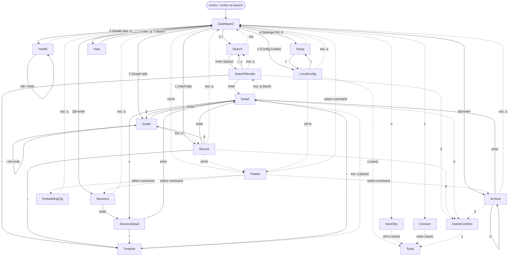

# Cortex TUI Guide

The Cortex terminal UI (TUI) is the interactive, keyboard-first surface over the local
SQLite memory store. It ships inside the `cortex` binary and is built on Bubble Tea +
Lip Gloss. This is the first user guide for that surface: it covers how to launch it,
what every screen and overlay is, the complete key map, the command palette, the theme
engine, the status bar and Command Deck, task-oriented workflows, how the TUI relates to
the CLI and to MCP, and the known quirks you will hit.

Everything below was verified against the landed source in `internal/tui` and the launch
wiring in `cmd/cortex/main.go` and `internal/cli/cli.go`. Where behavior is surprising it
is verified against the code, not the in-app help.

---

## 1. Overview

- **Runtime**: Bubble Tea program started by `internal/cli.runTUIReal` and constructed by
  `tui.NewWithScreen(deps, initialScreen)`.
- **Data**: the TUI is wired to the same dependency bundle (`internal/store/bundle`) that
  the local CLI and the local MCP server use. See section 8.
- **Model**: one `tui.Model` holds the active `Screen`, cursor, list components, input
  models, theme state, and modal flags. The screen enum lives in `internal/tui/model.go`.
- **Screens vs overlays**: screens replace the whole body; overlays are centered or
  bottom-anchored panels drawn on top of the current screen without unloading it.

The screen enum has **exactly 15 screens** and the view layer draws **5 overlays**.

---

## 2. Launching the TUI

### 2.1 `cortex tui`

```bash
cortex tui            # open on the Dashboard
cortex tui --config   # open directly on the Configuration Center (Local Settings)
```

`--config` only sets the initial screen to `tui.ScreenLocalConfig`. It does not change
where config is loaded from.

### 2.2 Bare invocation from an interactive terminal

Running `cortex` with no command in an interactive terminal launches the TUI on the
Dashboard. `cmd/cortex/main.go` checks whether stdout **and** stdin are TTYs
(`isInteractive`); when they are and no command was given, it injects the `tui` argument
before dispatching to `cli.Run`. This is what makes double-clicking the Windows binary
open the UI instead of printing help.

### 2.3 Configuration wizard

```bash
cortex config wizard          # TUI on a TTY, CLI wizard when piped
cortex config wizard --tui    # force the TUI Configuration Center
cortex config wizard --cli    # force the text wizard
```

`runConfigWizard` picks the TUI when `--tui` is passed, or when `--cli` is absent and
stdout is a terminal. It delegates to `cortex tui --config`.

### 2.4 Non-interactive fallback

When stdout or stdin is **not** a terminal (CI, pipes, redirected output), the bare
binary does **not** launch the TUI. With no command, `cli.Run` prints the usage text and
exits with code `1`. Scripted configuration must use the subcommands
(`cortex config get|set|show|validate|init`) or `cortex config wizard --cli`; the TUI is
never auto-started in a non-interactive context.

### 2.5 Exit

- `ctrl+c` quits immediately from anywhere (hard quit).
- `q` quits from the Dashboard and acts as "back" on most other screens.
- `esc` is "back" on most screens.

---

## 3. Screen map and navigation

### 3.1 Mermaid screen map



Dashed edges are overlays or back-navigation; solid edges are primary forward
transitions.

### 3.2 Screen inventory (15 screens)

| # | Screen (`Screen` value) | Title in status bar | Entry paths |
|---|---|---|---|
| 1 | `ScreenDashboard` | Dashboard | Default initial screen; command palette "Go to Dashboard"; back from most screens |
| 2 | `ScreenSearch` | Search | Dashboard `s` or `/`; palette "Search memories"; SearchResults `/` or `s` |
| 3 | `ScreenSearchResults` | Search Results | Press `enter` on a non-empty query in Search |
| 4 | `ScreenRecent` | Recent | Global `1` (Vault workspace); Dashboard menu item 2 + `enter` |
| 5 | `ScreenObservationDetail` | Detail | `enter` on a list item (Recent, SearchResults, Archive, Graph, Session Detail) |
| 6 | `ScreenTimeline` | Timeline | `t` from Recent, SearchResults, Detail, Session Detail |
| 7 | `ScreenSessions` | Sessions | Dashboard menu item 3 + `enter`; palette "Browse sessions" |
| 8 | `ScreenSessionDetail` | Session Detail | `enter` on a session; `s` from Detail |
| 9 | `ScreenSetup` | Setup | Global `4` (Settings workspace); palette "Setup agent plugin"; Local Settings `i` |
| 10 | `ScreenGraph` | Graph | Global `2` (Graph workspace); Detail `g`; Recent `g`; palette "Knowledge graph" |
| 11 | `ScreenArchive` | Archive | Dashboard menu item 6 + `enter`; palette "Archived observations" |
| 12 | `ScreenHealth` | Health | Global `3` (Health workspace); palette "Memory health" |
| 13 | `ScreenEmbeddingConfig` | Embedding Settings | Command palette "Embedding settings" only |
| 14 | `ScreenLocalConfig` | Local Settings | Dashboard `c`; `cortex tui --config`; palette "Local settings"; Setup `c` |
| 15 | `ScreenHelp` | Help | `?` from any screen that is not an input screen |

> There is no dedicated "Models" or "Usage Stats" screen. Model/provider selection lives
> on **Embedding Settings** (screen 13) and the AI section of **Local Settings**
> (screen 14); observation, edge, session, and memory-type counts are rendered on the
> **Dashboard**. This matches the `Screen` enum in `internal/tui/model.go:30-46`.

### 3.3 Overlays (5)

| Overlay | Trigger | Dismiss / act |
|---|---|---|
| Command palette | `ctrl+k` | type to filter; `up`/`ctrl+p`, `down`/`ctrl+n`, `enter` executes; `esc` closes |
| Quick Create Memory | `n` (Dashboard and list screens) | `tab`/`shift+tab` or `enter` to move fields; `ctrl+s` or `enter` on Save; `esc` cancels |
| Connect to Server / Auth | `L` | `tab`/`↑↓` navigate; `space` toggles mode; `enter` saves to YAML; `esc` cancels |
| Delete confirmation | `d` on a list/detail screen | `y` confirms, `n`/`esc` cancels |
| Toast / error notice | Any action that reports success, warning, or failure | Transient: clears on the next key press |

---

## 4. Keybinding matrix

### 4.1 Global keys

These are routed before any per-screen handler (`internal/tui/update.go:601-745`) and are
suppressed on text-input screens (`Search`, `Embedding Settings`, `Local Settings`,
`Help`) where noted.

| Key | Action | Notes |
|---|---|---|
| `?` | Open Help | Suppressed on Search, Embedding, Local Settings, Help |
| `ctrl+k` | Open command palette | Available everywhere |
| `1` | Vault workspace → Recent | Suppressed on input screens |
| `2` | Graph workspace → Graph | Same suppression; loads graph for the recent/first observation |
| `3` | Health workspace → Health | Same suppression |
| `4` | Settings workspace → Setup | Same suppression |
| `n` | Quick Create Memory modal | Suppressed on input screens |
| `t` | Toggle theme (dark ↔ light) | Suppressed on input screens |
| `L` | Connect to server (auth modal) | Suppressed on input screens |
| `u` | Dashboard: toggle Personal ↔ Admin Global stats | Dashboard only |
| `P` | Toggle upload/sync ("Upload to Cortex") | Dashboard and Local Settings only |
| `p` | Cycle project filter | Dashboard, Recent, SearchResults, Graph, Sessions |
| `v` | Toggle split preview pane | Recent, SearchResults, Archive |
| `ctrl+c` | Force quit | Always |
| `esc` / `q` | Back / quit | Handled per screen; see each table |

### 4.2 Dashboard (`handleDashboardKeys`)

| Key | Action |
|---|---|
| `up` / `k`, `down` / `j` | Move the menu cursor |
| `enter` / `space` | Activate the highlighted menu item |
| `5`–`9` | Jump directly to menu items 5–9 (Memory health, Archived, Search memories, Local settings, Connect to server) |
| `s` or `/` | Open Search (query input focused) |
| `r` | Jump to Recent observations |
| `g` | Open the Knowledge Graph |
| `c` | Open the Configuration Center (Local Settings) |
| `i` | Open Setup (install agent plugin) |
| `q` | Quit |
| `t`, `u`, `n`, `L`, `P` | Handled by the global router (theme, stats view, new memory, connect, sync) |

Digits `1`–`4` are intercepted globally as **workspace switches**, and menu items `[10]`
and `[11]` have no digit binding. See the quirks section.

### 4.3 Search — query input focused (`handleSearchInputKeys`)

| Key | Action |
|---|---|
| `enter` | Run the query (memory search or code search, depending on the current source) |
| `tab` | Switch source: `Memories` ↔ `Code AST` |
| `f` | Cycle the active project filter |
| `up` / `down` | Walk the in-session query history (last 20 queries) |
| `esc` | Blur and return to the Dashboard |
| any other key | Edit the query text |

When the input is **not** focused (`handleSearchKeys`): `esc`/`q` returns to the
Dashboard, and `i` or `/` re-focuses the input.

### 4.4 Search Results (`handleSearchResultsKeys`)

| Key | Action |
|---|---|
| `j` / `k` | Move through results (Bubble Tea list) |
| `enter` | Open the observation detail; in code mode, open the symbol preview |
| `t` | Timeline (memory mode only) |
| `f` | Cycle project filter and re-run the query |
| `d` | Delete with confirmation (memory mode only) |
| `/` or `s` | Start a new search |
| `p` | **Shadowed** — the global router cycles the project filter first; see quirks |
| `v` | Toggle the split preview pane |
| `esc` / `q` | Back to Search |

### 4.5 Observation Detail (`handleObservationDetailKeys`)

| Key | Action |
|---|---|
| `up` / `k`, `down` / `j` | Scroll the content viewport one line |
| `pgup` / `pgdown` | Half-page scroll |
| `t` | Timeline for this observation |
| `g` | Open the Knowledge Graph rooted on this observation |
| `s` | Jump to the observation's session (when a session id is present) |
| `d` | Delete with confirmation |
| `esc` / `q` | Back to the previous screen |

### 4.6 Graph (`handleGraphKeys`)

| Key | Action |
|---|---|
| `j` / `k` | Move through related observations |
| `enter` | Open the observation detail |
| `r` | Re-root the graph on the selected observation |
| `esc` / `q` | Back |

### 4.7 Archive (`handleArchiveKeys`)

| Key | Action |
|---|---|
| `j` / `k` | Move through archived observations |
| `enter` | Open the observation detail |
| `u` | Restore (unarchive) the selected observation |
| `d` | Delete with confirmation |
| `f` | Cycle project filter |
| `esc` / `q` | Back to the Dashboard |

### 4.8 Health (`handleHealthKeys`)

| Key | Action |
|---|---|
| `j` / `k` | Scroll |
| `tab` | Cycle section: Stale → Orphans → Consolidation |
| `enter` | Expand / collapse the current section |
| `esc` / `q` | Back to the Dashboard |

### 4.9 Embedding Settings (`handleEmbeddingConfigKeys`)

| Key | Action |
|---|---|
| `j` / `k` | Move between fields (Provider, Model, Vector, Auto-start, Save) |
| `h` / `l` (or `left` / `right`) | Cycle the embedding provider |
| `space` | Toggle the focused checkbox (Vector, Auto-start) |
| `enter` | Edit the model name, or Save when the Save button is focused |
| `r` | Reload configuration from disk |
| `x` | Reindex all embeddings (available after a Save when the provider/model changed) |
| `s` | Post-save: start Ollama when it is not running |
| `p` | Post-save: pull the configured Ollama model when it is missing |
| `esc` / `q` | Back to the Dashboard |

### 4.10 Local Settings / Configuration Center (`handleLocalConfigKeys`)

| Key | Action |
|---|---|
| `tab` / `shift+tab` | Move between sections (Storage, AI & LLM, HTTP API, MCP Proxy, Sync, Review) |
| `j` / `k` | Move between fields |
| `h` / `l` (or `left` / `right`) | Cycle the focused choice (format, provider, MCP profile) |
| `enter` | Edit a text field, cycle a choice, or Save when the Save button is focused |
| `space` | Toggle / cycle the focused control (format, provider, HTTP, profile, remote, sync) |
| `t` | Test the configured LLM connection |
| `i` | Jump to Setup (agent plugins) |
| `s` | Validate and save the configuration to disk |
| `r` | Reload from disk |
| `esc` / `q` | Back to the Dashboard |

### 4.11 Setup — agent plugins (`handleSetupKeys`)

| Key | Action |
|---|---|
| `j` / `k` | Move through detected agents |
| `enter` | Install the selected agent plugin |
| `p` | Cycle the install profile: agent (22 tools) → dev (11 tools) → minimal (5 tools) |
| `c` | Jump to Local Settings (Configuration Center) |
| `y` / `n` | Answer the Claude Code allowlist prompt after installation |
| `enter` / `esc` / `q` | Leave the post-install result screen |
| `esc` / `q` | Back to the Dashboard |

---

## 5. Command palette

Open with `ctrl+k`. Type to filter by command name (case-insensitive substring), `up` /
`ctrl+p` and `down` / `ctrl+n` move the cursor, `enter` runs the highlighted command, and
`esc` closes the palette. The palette is defined by `allCommands()` in
`internal/tui/update.go` and renders in `internal/tui/view_modals.go`.

| Command | Shortcut hint | Effect |
|---|---|---|
| Search memories | `/` | Open Search with the query input focused |
| Recent observations | — | Open Recent |
| Browse sessions | — | Open Sessions |
| Knowledge graph | — | Open Graph |
| Memory health | — | Open Health |
| Archived observations | — | Open Archive |
| Embedding settings | — | Open Embedding Settings |
| Local settings | — | Open the Configuration Center |
| Connect to server | `L` | Open the auth / connect modal |
| Setup agent plugin | — | Open Setup |
| Help / Keyboard shortcuts | `?` | Open the Help screen |
| Go to Dashboard | — | Return to the Dashboard and reload stats |

---

## 6. Theme engine

### 6.1 How it works

- Two palettes are defined in `internal/tui/styles.go`: `darkPalette` (base `#090d16`) and
  `lightPalette` (base `#f8fafc`). Each maps the same semantic colors (background, panel,
  text, cyan, blue, purple, green, amber, red, mauve, teal, gold, highlight).
- `ApplyTheme(dark bool)` selects a palette, copies its colors into the package-level
  color variables, and rebuilds every Lip Gloss style via `rebuildStyles()`.
- `ToggleTheme()` flips the current mode and returns the new state; `IsDark()` reports it.
- The `t` key calls `ToggleTheme()`, updates the model's theme badge, and shows a
  `Theme: Dark Mode activated` / `Theme: Light Mode activated` toast.

### 6.2 Persistence behavior — **not persisted**

The theme is **session-only**. There is no theme key in the configuration model and no
write path for the theme choice: `internal/config` has no theme field, and neither the
auth modal nor the Local Settings save touches one. On every start the TUI is dark
(`Model.IsDarkTheme: true`, `currentIsDark = true`).

### 6.3 Verifying persistence

1. Launch `cortex tui` and read the status bar: it shows `🌙 Dark`.
2. Press `t`. The toast reads `Theme: Light Mode activated` and the status bar flips to
   `☀️ Light`.
3. Exit (`ctrl+c` or `q` from the Dashboard) and relaunch `cortex tui`.
4. Observe `🌙 Dark` again — the light selection did **not** survive the restart.
5. Optionally confirm the absence of a persisted key: `cortex config show` has no theme
   entry.

This is the documented, observed behavior. Do not expect a theme preference to be
restored across restarts.

---

## 7. Status bar and Command Deck

### 7.1 Status bar anatomy

`renderStatusBar` (`internal/tui/view.go`) builds the bottom bar from left to right:

| Segment | Example | Meaning |
|---|---|---|
| Screen name | `Search Results` | Human-readable name of the active screen |
| User badge | `👤 alice [ADMIN]` | `CurrentUser` (from `USER`/`USERNAME` or the configured principal) and uppercased role |
| Theme badge | `🌙 Dark` / `☀️ Light` | Current theme mode |
| List position | `[3/42]` | Selected index / total items (Recent, SearchResults, Sessions, Graph, Archive only) |
| Observation count | `1024 obs` | Total observations (full mode only) |
| Project filter | `prj: cortex` | Shown only when a project filter is active |
| Preview state | `preview: on` | Shown only when the split preview is visible |
| Sync state | `sync: on` / `local only` | Whether "Upload to Cortex" is enabled |
| Version | `v2.x.y` | Binary version when known |
| Context help | `j/k nav • enter select • …` | Dashboard gets a menu hint; other screens get the standard `n new • t theme • L login • ? help • Esc back` hint |

Error messages and toasts render just above the status bar, not inside it.

### 7.2 Command Deck header

`renderDeckHeader` (`internal/tui/view_header.go`) is drawn on every screen **except the
Dashboard** and is hidden in compact mode. Its anatomy:

- **Brand row**: `CORTEX` + version, followed by `user (role) • local|cloud sync • dark|light`.
- **Workspace tabs**: `[1] Vault`, `[2] Graph`, `[3] Health`, `[4] Settings`, with the
  active tab highlighted. These are the same `1`–`4` global switches.
- **Separator**: a horizontal rule sized to the terminal.

### 7.3 Compact mode

`isCompact()` returns true when `Width < 60` or `Height < 20`. In compact mode:

- The Command Deck header is not drawn.
- The status bar is reduced to the screen name, the user badge, the theme badge, and the
  list position (joined with `|`).
- The Dashboard width clamps to 100 columns, and the split preview is disabled when the
  terminal is narrower than 100 columns on resize.

---

## 8. Workflows and CLI/TUI/MCP interplay

### 8.1 Capture a memory

1. Press `n` from the Dashboard or any list screen. The Quick Create Memory modal opens on
   the Title field.
2. Type the title; `tab`/`shift+tab` (or `enter`) move to Content, Type, Project, Save.
   Type defaults to `decision`; Project defaults to the active filter (else `default`).
3. Press `ctrl+s` or `enter` on Save. A `Memory created: <title>` toast appears and Recent
   observations + stats refresh.

### 8.2 Search memory, then code

1. Dashboard → `s` (or `/`). The Search screen shows `Source: Memories`.
2. Type a query and press `enter`. Results land on Search Results.
3. Press `tab` on the Search screen to switch `Source:` to `Code AST` and repeat `enter`
   to search indexed symbols instead of memories.
4. `enter` on a result opens Detail; from there `t` shows the session timeline and `g`
   opens the graph rooted on that observation. `esc` walks back.

### 8.3 Filter by project

The global cycler is `p` (Dashboard, Recent, SearchResults, Graph, Sessions). It also
works as `f` on the Search input and on the SearchResults / Recent / Archive screens. A
`Filter project: <name>` toast confirms each change and the affected lists re-query.

### 8.4 Preview a result

On Recent, SearchResults, and Archive press `v` to toggle the split preview pane on the
right; `j`/`k` updates its content. `v` toggles it off again. (The `p` key documented in
some help text is shadowed — see quirks.)

### 8.5 Delete an observation

Press `d` on a search result, recent item, detail view, or archive item. A centered
confirmation modal shows the title; `y` deletes and toasts `Observation #N deleted`, `n` or
`esc` cancels. Any other key also cancels the confirmation.

### 8.6 Embedding setup and reindex

1. Open the command palette (`ctrl+k`) and choose **Embedding settings**.
2. `j`/`k` to the Provider field and `h`/`l` to cycle `none` / `ollama` / `openai`.
3. `space` toggles Vector search and Ollama auto-start; `enter` on the Model field edits
   the model name.
4. `enter` on Save writes the configuration. If the provider or model changed, a
   `Provider/model changed — existing embeddings may be stale` warning appears.
5. Press `x` to reindex all observations; a progress bar reports completion.
6. When Ollama is selected, post-save keys `s` (start Ollama) and `p` (pull model) appear
   based on its running/model status.

### 8.7 Configuration center

Press `c` from the Dashboard (or `cortex tui --config`). Move across the six sections with
`tab`/`shift+tab`, edit fields with `enter`, toggle with `space`, test the LLM endpoint
with `t`, and save with `s`. A `Configuration saved successfully` message appears with a
reminder to restart to apply runtime changes.

### 8.8 Connect to a Cortex server

Press `L` (or the palette's "Connect to server"). Enter the Server URL and bearer token,
choose **Hybrid (Local-First + Sync)** or **Remote MCP Proxy** with `space`, and `enter`
to save. The settings are written to the active YAML config file; the token is exported to
`CORTEX_HTTP_TOKEN` for the session and is never written as a plaintext value.

### 8.9 How the TUI, CLI, and MCP interact

All three surfaces operate on the **same local SQLite store**, opened through
`internal/app` and wired from `internal/store/bundle`:

- The CLI (`cortex search|save|context|stats|…`) opens the app composition per command.
- The TUI receives the observation, session, search, code, graph, scoring, and entity
  stores from that same bundle.
- The local MCP server exposes the `cortex_*` tool set over stdio, with the `agent`,
  `dev`, and `minimal` profiles. Server-side MCP is a separate authenticated subset.

Because they share one database file, a write made in the TUI is immediately visible to
the next CLI or MCP call, and vice versa. There is no separate TUI cache. Concurrent use
is supported but SQLite still serializes writers: avoid running heavy simultaneous writes
from several surfaces at once, and prefer closing or idling the TUI before bulk CLI
imports or a full `reindex`.

---

## 9. Known quirks

Each item below was verified against the current source; none is a documentation-only
claim.

### 9.1 `p` on Search Results / Recent is shadowed by the project filter

- **Screen**: Search Results (and Recent).
- **Expected**: `p` toggles the split preview pane (`handleSearchResultsKeys`,
  `internal/tui/update.go:1118`).
- **Actual**: the global project-filter cycler at `internal/tui/update.go:734` runs first
  for `ScreenSearchResults`/`ScreenRecent`, so `p` cycles the project filter and the
  preview branch is never reached.
- **Workaround**: use `v` to toggle the preview pane.

### 9.2 Dashboard menu items `[10]` and `[11]` have no digit binding

- **Screen**: Dashboard.
- **Expected**: the footer reads `1-9/enter select`, implying a numeric shortcut per item.
- **Actual**: `handleDashboardKeys` binds digits only for items `1`–`9`. `[10] Setup agent
  plugin` and `[11] Quit` are selectable only by moving the cursor with `j`/`k` and
  pressing `enter` (Quit is also available via `q` / `ctrl+c`).

### 9.3 Dashboard digits `1`–`4` do not select the labeled menu rows

- **Screen**: Dashboard.
- **Expected**: `[1] Configuration Center`, `[2] Recent observations`, `[3] Browse
  sessions`, `[4] Knowledge graph` suggest per-row shortcuts.
- **Actual**: the global router captures `1`–`4` as Command Deck workspace switches: `1`
  opens Recent, `2` opens Graph, `3` opens Health, `4` opens Setup. Those four menu rows
  remain selectable with `j`/`k` + `enter`.

### 9.4 In-app Help describes `f` as the global project-filter key

- **Screen**: Help.
- **Expected**: the Help view (`internal/tui/view_modals.go`) lists `f` → "Cycle project
  filter" under both Global and List screens.
- **Actual**: the **global** cycler is `p` (`internal/tui/update.go:734`). `f` only works
  while the Search input is focused and on the Search Results, Recent, and Archive
  screens. On other screens `f` does nothing.

### 9.5 Theme choice does not persist across restarts

- **Screen**: any.
- **Expected**: after pressing `t`, the selection would survive a restart.
- **Actual**: there is no persistence path; the TUI always starts in dark mode. See
  section 6 for the verification steps.

### 9.6 The Dashboard "Press [U] to install" update banner is inert

- **Screen**: Dashboard.
- **Expected**: when an update is available the banner says `Press [U] to install`.
- **Actual**: the global `u`/`U` handler (`internal/tui/update.go:709`) intercepts the key
  on the Dashboard to toggle the Personal/Admin stats view, so the self-update branch in
  `handleDashboardKeys` is never reached. Update from the CLI instead:
  `cortex update`.

---

## Appendix: where these bindings live

For reviewers and contributors, the authoritative sources for every claim above are:

- Screen enum and model state: `internal/tui/model.go`
- Global router and per-screen key handlers: `internal/tui/update.go`
- Views, status bar, compact mode: `internal/tui/view.go`, `view_header.go`,
  `view_dashboard.go`, `view_knowledge.go`, `view_control.go`, `view_graph.go`,
  `view_health.go`, `view_modals.go`
- Theme engine and palettes: `internal/tui/styles.go`
- Key-handler coverage: `internal/tui/keys_coverage_test.go`
- Launch wiring: `cmd/cortex/main.go`, `internal/cli/cli.go`
