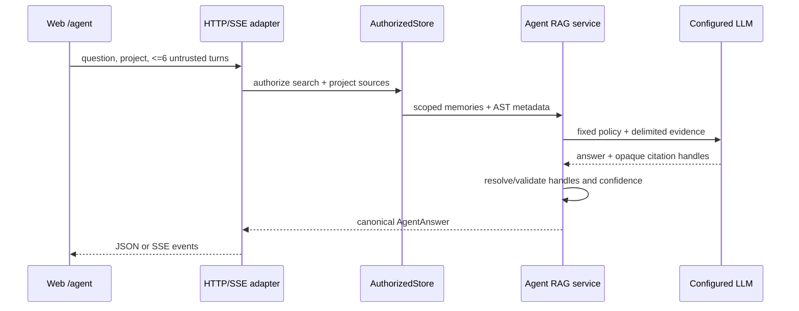

# Design: Server Conversational Project Agent

## Architecture

Add `internal/domain/agent` with transport-neutral request/result/source types and a `Service`. The service receives narrow ports for authorized project discovery, memory hybrid retrieval, AST retrieval, completion and audit. `internal/platform/server` owns adapters and two handlers; neither handler contains retrieval or prompt logic. The Web client sends the same request shape to JSON or SSE.

## Security Boundaries

- Entry requires `ResourceSearch/ActionSearch`. Each memory read requires `ResourceMemory/ActionRead`; AST access requires new `ResourceCode/ActionRead`, always with principal-derived tenant/workspace and selected project.
- `GET /api/agent/projects` returns only projects granted for search and at least one readable corpus. A project absent from that set returns `403 project_not_granted` without existence disclosure.
- PostgreSQL migration 109 creates scoped AST tables with composite tenant/workspace/project identities, forced RLS and runtime privileges limited to scoped operations. Existing dynamic DDL is removed from runtime.
- The prompt has immutable policy, untrusted history, untrusted question and evidence in distinct delimiters. Evidence instructions are quoted as data. The model has no tools and cannot choose provider, model, destination or retrieval scope.
- The model emits opaque source handles. The server resolves only handles issued for that request and removes unsupported claims/citations before delivery.

## Retrieval and Answer Contract

Retrieval runs authorized hybrid memory search and bounded AST symbol/relationship search concurrently. AST includes names, kinds, signatures, documentation summary, paths, positions and edges, never file bodies. A deterministic context budget ranks and truncates evidence. `AgentAnswer` contains `answer`, validated `sources[]`, `confidence` (`low|medium|high` plus score), and `retrieval.degraded[]`.

JSON returns the complete object. SSE uses `meta`, ordered `delta`, `sources`, `done` and sanitized `error` events; `done` carries the canonical final metadata. Disconnect cancels retrieval/provider work. Both transports call the same service method.

## Limits and Operations

Hard request limits: question 8 KiB; six user/assistant turn pairs (12 messages), 4 KiB each and 24 KiB aggregate; no client-supplied system role. Defaults: 30 s JSON, 60 s stream, 1,200 output tokens; hard output cap 4,096. Existing token rate-limit tiers gain agent request/token budgets; concurrency is bounded per tenant and provider. Rejections use stable `400/403/413/429/499/503/504` classifications.

Audit records request/correlation ID, actor, tenant/workspace/project, transport, result class, duration, token counts, source counts, confidence and degraded flags. It MUST NOT record question, history, answer, memory/code content, secrets, embeddings or provider URLs.
The pre-provider authorization audit is mandatory and fails closed; outcome-audit delivery failures after generation are surfaced through content-free operational telemetry.

## Web UX

`/agent` loads server-filtered projects, keeps only six turns in component memory, defaults to JSON and allows SSE progressive delivery. It provides Stop/Retry/New conversation, keyboard focus, `aria-live`, visible source cards, confidence/degraded messaging, responsive layout and no transcript persistence in local/session storage.
