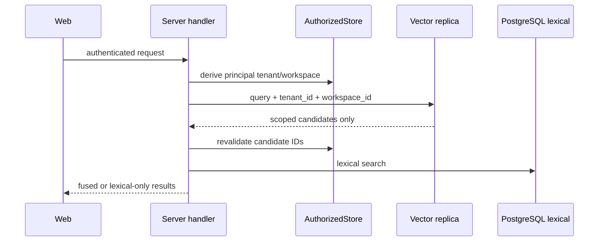

# Design: Harden Server P0 Boundaries

## Context

The server composition root is `internal/platform/server`; authenticated requests obtain request-scoped `Operations`. External vectors are optional replicas and PostgreSQL remains authoritative. Local SQLite/CLI behavior must remain unchanged.

## Decisions

### 1. Narrow administrative authorization

Add `AuthorizeAdminManage(context.Context) error` to the server `Operations` boundary, forward it through `requestOperations`, and implement it with `AuthorizedStore.authorize(ResourceAdmin, ActionManage, ...)`. Each `/api/admin/ai/*` handler invokes it before inspecting configuration or running a probe. Authorization/audit failure returns the existing sanitized `403`/`500` operation errors.

### 2. Production-composed probes

Inject an `adminAIProbes` interface into `apiHandler`. Its LLM implementation uses the already composed `extraction.Service` and fixed bounded input; its embedding implementation uses the already composed `embedding.Service`. No handler reads environment secrets, resolves arbitrary URLs, uses `http.DefaultClient`, or accepts destination/model/prompt input. Probe responses expose status, model/provider identity and latency, not credentials or raw upstream errors.

### 3. Exact CORS

Server validation rejects `*` and malformed origins (non-HTTP(S), userinfo, path, query or fragment). The middleware trims configured values and compares the request `Origin` exactly. An empty list emits no CORS headers. `OPTIONS` receives `204` only for an allowed origin; otherwise it flows to the protected router without approval.

### 4. Distinct database authority

Configuration loading no longer copies runtime DSN into migration DSN. `server.Open` allows that fallback only under `BootstrapDevelopment`. Otherwise both DSNs are required and parsed role names MUST differ before opening a connection. Full migration-job separation is a follow-up because startup also performs privileged service-principal reconciliation.

### 5. Workspace-bound vectors

Server vector writes and reindex accept an immutable boundary `{tenant_id, workspace_id}` derived from trusted composition/request context. Server vector queries always include both exact filters. pgvector adds `workspace_id TEXT NOT NULL DEFAULT ''` plus a tenant/workspace index; Qdrant forwards both payload filters. Empty/missing legacy metadata never matches a scoped query.

## Failure and Rollback

Unauthorized/probe/configuration failures are fail-closed. Vector errors, missing workspace metadata or incomplete legacy coverage suppress the vector branch while preserving authorized lexical search. Rollback may disable vector retrieval; it MUST NOT weaken CORS, authorization or DSN separation. No destructive vector deletion occurs during rollout.

## Follow-Up

Move migrations and bootstrap reconciliation to a one-shot job with the migration role, leaving the long-running process with runtime credentials only.

