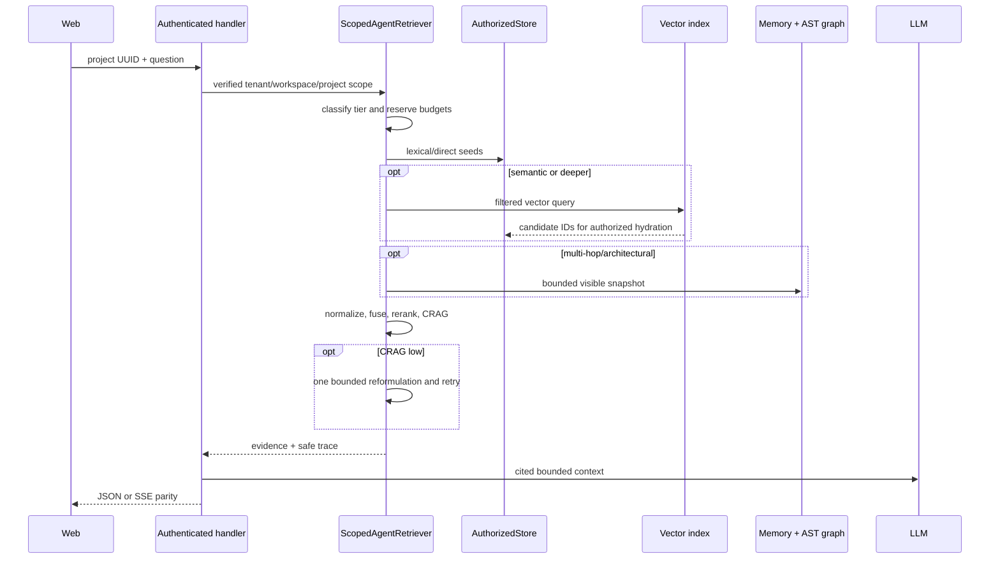

# Design: Deep ScopedAgentRetriever

## Selected architecture

`internal/domain/agent` owns a narrow retrieval port returning evidence plus safe trace metadata. `internal/platform/server` implements one deep `ScopedAgentRetriever`; only it coordinates authorized PostgreSQL operations, embeddings, vectors and pure `internal/retrieval`/graph algorithms. Stores expose bounded scope-safe snapshots, never repositories or transactions.

## Invariants

- Authority is immutable: tenant/workspace come from verified context; project selection is an authorized public UUID. Labels are presentation only.
- Vector IDs are untrusted hints. Hydration MUST apply the same classification-clearance and personal-owner predicate as lexical reads.
- Scores enter a common `[0,1]` range before RRF/MaxSim/PPR contributions. Multi-hop PPR seeds combine normalized lexical, dense and AST hits.
- Hop/node/edge/evidence budgets are validated and reserved before graph expansion or corpus materialization. Memory and AST snapshots are independently bounded and contain only visible project observations, accepted current edges and scoped symbols/relations; no full source bodies enter prompts.
- Seeds, nodes, edges, PPR ties and final evidence use canonical deterministic ordering by kind and public handle before truncation.
- The production path MUST obtain `GetAgentGraphSnapshot` through `requestOperations`, which delegates to the authenticated context-bound `Operations`/`AuthorizedStore`; transports never receive a raw store.
- Architectural summaries are derived read-only and cached only by `(tenant, workspace, project UUID, memory checksum, AST index checksum)`; mismatch is a cache miss.
- CRAG may issue one reformulation with the same scope and budgets. A second low grade abstains.
- Trace metadata contains enumerated tier/stage/status, counts, duration buckets, checksums/generations and degradation codes; never queries, prompts, content, internal IDs or authorization details.

## Design choice

Calling `ExecuteAdaptiveSearch` directly from `agentMemoryRetriever` was rejected: it leaves vector search unused, splits AST from memory, and exposes shallow orchestration. A new external GraphRAG service was rejected for duplicated authorization/storage and operational cost. The selected deep retriever maximizes locality and reuses Cortex's pure-Go engines.

## Budgets and failure

Each tier has fixed lexical/vector/hop/node/edge/evidence/token/time budgets, applied before acquisition and expansion. Availability failures degrade only the affected branch when authorized evidence remains; missing authenticated operations, denial, scope/identity mismatch, or visibility uncertainty fail the request closed. Cancellation propagates through every branch. No provider fallback crosses configured vector adapters.

## Verification and rollout

Unit tests pin routing, normalization, bounded materialization, deterministic ordering, production delegation, one-rewrite CRAG and metadata parity. Before architectural summaries, a tagged PostgreSQL 16 canary proves the real `requestOperations` path, sibling-scope exclusion and failure classification. Ship server first behind the feature flag, compare retrieval metrics, then enable redesigned Web pages. Remove the flag only after recall, citation fidelity, latency and isolation gates pass.
